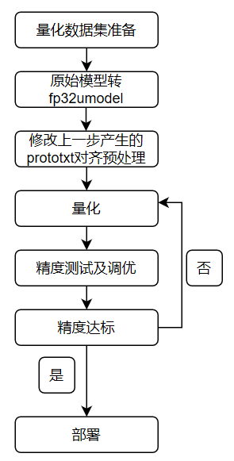

Quantization-Tools简介
======================
简介
----
Qantization-Tools是比特大陆自主开发的网络模型量化工具，
它解析各种不同框架已训练好的32bit浮点网络模型，生成8bit的定点网络模型。
该8bit定点网络模型，可用于比特大陆SOPHON系列AI运算平台。在SOPHON运算平台上，
网络各层输入、输出、系数使用8bit来表示，并支持混合精度计算，
从而在保证网络精度的基础上，大幅减少功耗和内存占用以及数据传输延迟，大幅提高运算速度。

Quantization-Tools由三部分组成：Parse-Tools、Calibration-Tools以及Uframwork,如 :ref:`ch2-001` 所示：

.. _ch2-001:

.. figure:: ../_static/ch2_001.png
   :width: 5.76in
   :height: 4.76in
   :align: center

   Quantization-Tools结构图

- Parse-Tools：

  解析各深度学习框架下已训练好的网络模型，生成统一格式的网络模型文件—umodel，
  支持的深度学习框架包括： caffe、tensorflow、 pytorch、 mxnet以及darknet。

- Calibration-Tools：

  分析float32格式的umodel文件，基于熵损失最小原则，将网络系数定点化成8bit，最后
  将网络模型保存成int8格式的umodel文件。

- Uframework：

  自定义的深度学习推理框架，集合了各开源深度学习框架的运算功能，提供的功能包括：

  a) 作为基础运算平台，为定点化提供基础运算。

  b) 作为验证平台，可以验证fp32，int8格式的网络模型的精度。

  c) 作为接口，通过bmnetu，可以将int8umodel编译成能在SOPHON运算平台上运行的bmodel。

----------------------------------------------

量化步骤
--------
使用Calibration-tools量化网络流程如下图：

.. _ch2-002:

   量化流程

具体量化步骤的说明如下：

1. 量化数据集准备

    Quantization-tools作为一个Post-Training量化工具，对已经训练好的float32网络进行量化。此过程需要一定
    数量的真实数据用float32网络进行推理，推理过程中会统计每层的输入输出数据范围作为量化参考。
    量化之前需要将数据集制作成lmdb格式，此步骤使用到的工具为convert_imageset。

#. float32网络转换

    需要将基于不同框架的网络转换为float32 Umodel之后进行量化，此过程中可以指定第一步准备好的数据作为推理输入。
    此步骤使用到的工具为ufw.tools.*_to_umodel。

#. 对齐预处理

    需要修改上一步产生的prototxt文件，对齐网络预处理。

#. 量化网络

    通过一定次数的推理统计和计算量化参数，将float32 Umodel转化为int8 Umodel。此步骤使用到的工具为calibration_use_pb。

#. 精度测试与调优

    此步骤可能与量化网络一起进行多轮，通过验证量化后网络是否满足精度或者速度要求，对量化参数进行调节，达到预期目标。
    此步骤使用到的工具为ufw test_fp32/ufw test_int8、可视化工具。

#. 网络部署

    量化完成后部署，与float32网络部署类似。使用bmnetu工具将int8 Umodel转换成最终能部署到SOPHON相关设备上的int8 Bmodel。

 :ref:`quant_steps` 中有具体步骤的详细描述。
以上提到的所有工具均随BmnnSDK一起发布。
