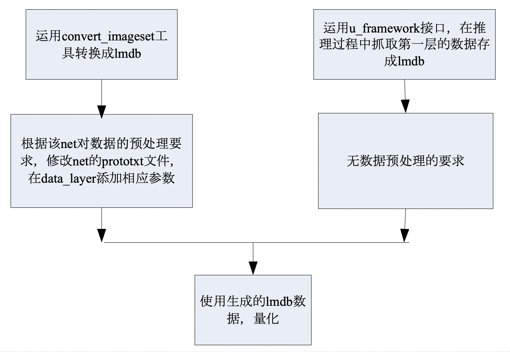
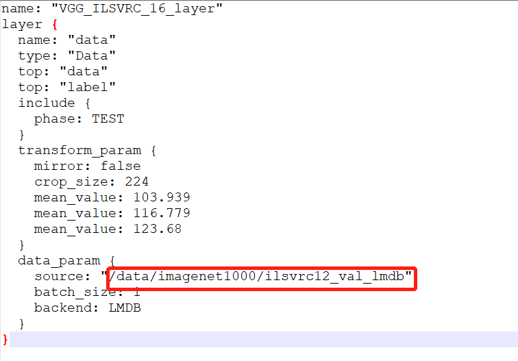
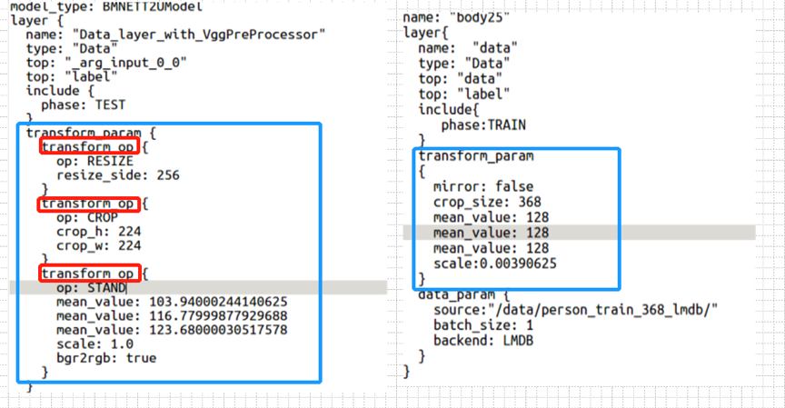
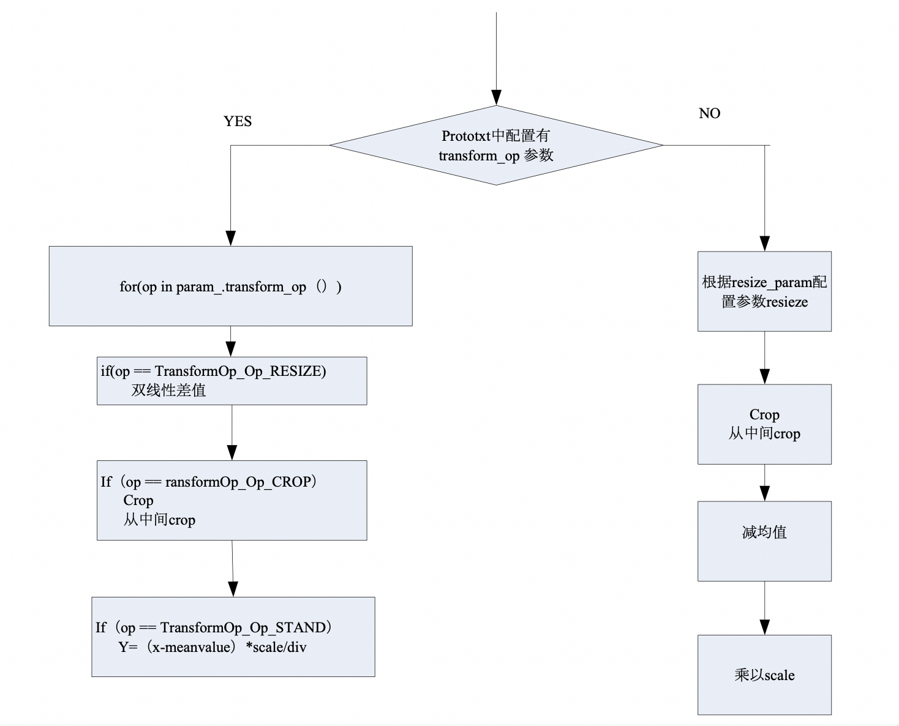
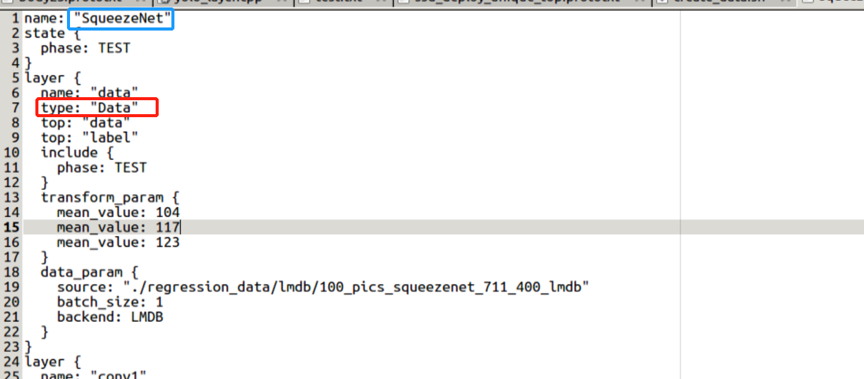
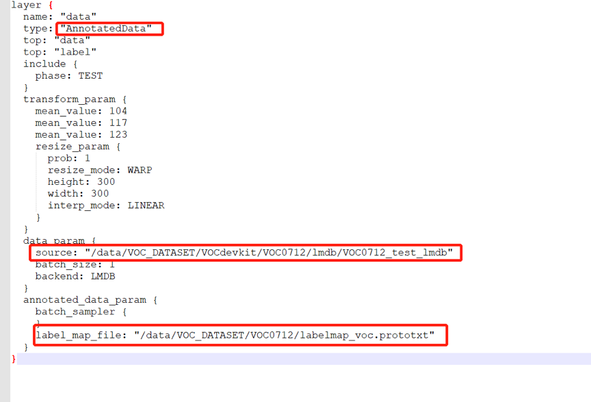
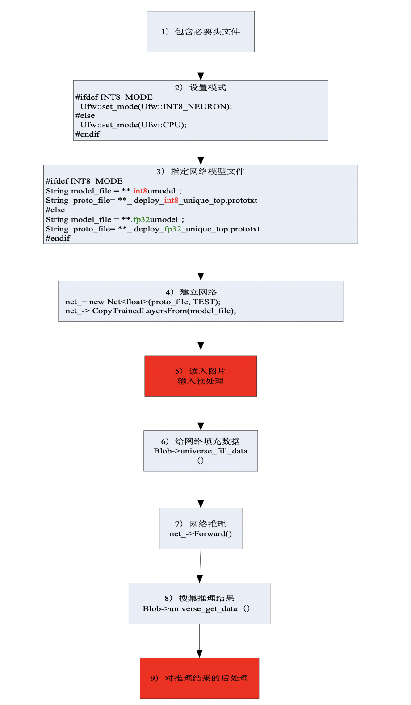
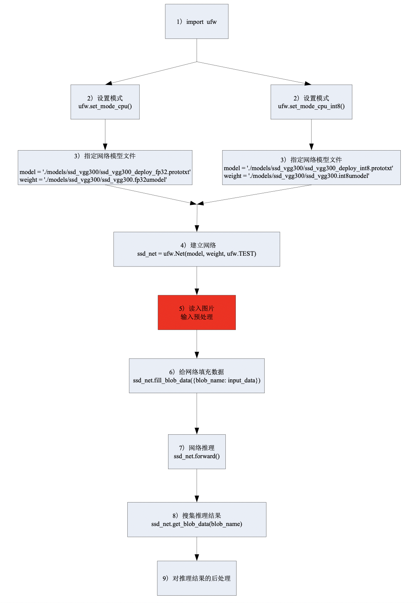
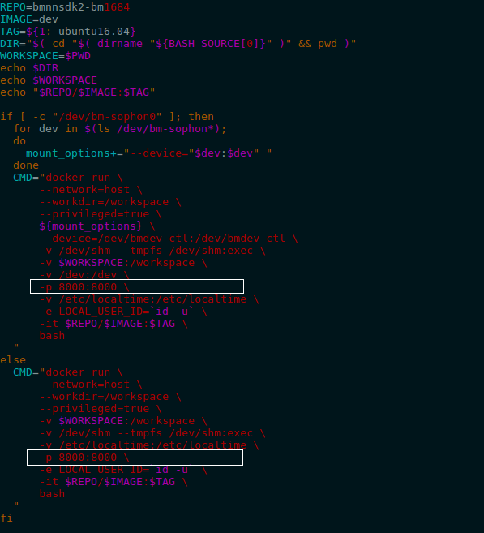
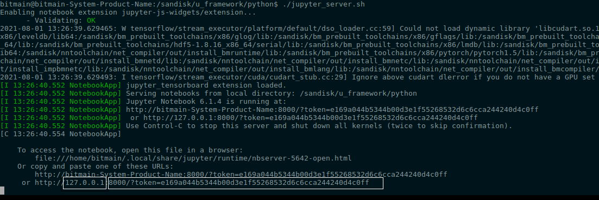

.. _quant_steps:

量化步骤
========

以量化Caffe框架下的网络为例，需要以下5步骤:

- 准备lmdb数据集

- 生成fp32umodel

- 生成int8umodel

- 精度测试（optional）

- int8 umodel的部署

.. _prepare-lmdb:

准备lmdb数据集
--------------

- Quantization-tools对输入数据的格式要求是[N,C,H,W]  (即先按照W存放数据，再按照H存放数据，依次类推)
- Quantization-tools对输入数据的C维度的存放顺序与原始框架保持一致。例如caffe框架要求的C维度存放顺序是BGR；tensorflow要求的C维度存放顺序是RGB


需要将图片转换成lmdb格式的才能进行量化。 将数据转换成lmdb数据集有两种方法：

a) 运用convert_imageset工具，方法见下文

b) 运用u_framework接口，在网络推理过程中将第一层输入抓取存成lmdb，方法请参考 :ref:`u_framework`

转换流程见图4.1

.. _ch4-001:



   两种生成lmdb数据集的操作流程


运用convert_imageset工具
````````````````````````

以 :ref:`create-lmdb-demo` 作为示例程序，描述了convert_imageset的使用。

convert_imageset工具通过调用Opencv接口将图片数据进行解码，转化为CHW排列的浮点数据，然后将其写入lmdb。convert_imageset通过命令行方式使用，命令行的参数配置如下：

  .. code-block:: shell

     $ convert_imageset \
                  ImgSetRootDir/ \     #图片集的根目录
                  ImgFileList.txt\     #图片列表及其标注
                  imgSetFolder   \     #生成的lmdb的文件夹
                  可选参数


- ImgSetRootDir：  图片集的根目录
- ImgFileList.txt：  该文件中记录了图片集中的各图样的相对路径（以ImgSetRootDir为根目录）和相应的标注（非必须），假如ImgFileList.txt 的内容为

  ::

     subfolder1/file1.JPEG 7
     subfolder1/file2.JPEG 1
     subfolder1/file3.JPEG 2
     subfolder1/file4.JPEG 6


对于第一行，表示图像文件存放的位置为ImgSetRootDir/subfoler1/file1.JPEG, 它的label为7。

**注意** “subfolder1/file1.JPEG” 与 “7”之间有一个空格。

- imgSetFolder：表示生成的lmdb所在的文件夹

- 可选参数设置

  .. code-block:: shell

    --gray：bool类型，默认为false，如果设置为true，则代表将图像当做灰度图像来处理，否则当做彩色图像来处理
      例如 --gray=false

    --shuffle：bool类型，默认为false，如果设置为true，则代表将图像集中的图像的顺序随机打乱
      例如 --shuffle=false

    --backend：string类型，可取的值的集合为{"lmdb", "leveldb"}，默认为"lmdb"，代表采用何种形式来存储转换后的数据
      例如 --backend=lmdb

    --resize_width：int32的类型，默认值为0，如果为非0值，则代表图像的宽度将被resize成resize_width
      例如  --resize_width = 200

    --resize_height：int32的类型，默认值为0，如果为非0值，则代表图像的高度将被resize成resize_height
      例如  --resize_height = 200

    --check_size：bool类型，默认值为false，如果该值为true，则在处理数据的时候将检查每一条数据的大小是否相同

    --encoded：bool类型，默认值为false，如果为true，代表将存储编码后的图像，具体采用的编码方式由参数encode_type指定
      例如 --encoded=false

    --encode_type：string类型，默认值为""，用于指定用何种编码方式存储编码后的图像，取值为编码方式的后缀（如'png','jpg',...）


并非所有的量化数据都需要label，多数情况下仅仅提供输入数据就可完成量化。只有需要进行后处理或者精度统计
时候才需要label进行GroundTruth数据传递。在 :ref:`create-lmdb-demo` 例子中，简单的将某个目录下的量化数据转化为lmdb
就已经满足需求。

生成lmdb需要的ImgFileList文件可以参考例子中的脚本：

  .. code-block:: shell

      function cali_gen_imagelist()
      {
         pushd $IMG_DIR
         rm -rf ImgList.txt
         find ./ -name  *cat.jpg | cut -d '/' -f2 | sed "s/$/ 1/">>ImgList.txt
         find ./ -name *bike.jpg | cut -d '/' -f2 | sed "s/$/ 2/">>IList2.txt

         cat IList2.txt>>ImgList.txt
         rm -rf IList2.txt

         ret=$?;
         if [ $ret -ne 0 ]; then echo "#ERROR: Gen Image List"; popd; return $ret; fi
         echo "#INFO: Create Imageset Done"
            popd;
         return $ret;
      }


如何使用生成的lmdb在 :ref:`using-lmdb` 中描述，配合其中描述的前处理为量化期间的推理准备好数据。对于一般简单的情况，只需将量化输入图片
进行解码和格式转换就可以了。而对于前处理不能精确表达的复杂处理，或者在级联网络中需要把中间结果作为下一级网络的输入进行训练的情况，
也可以自己开发预处理脚本，直接生成lmdb，方法请参考 :ref:`u_framework`。


.. _generate_fp32umodel:

生成fp32umodel
--------------

为了将第三方框架训练后的网络量化，需要先将它们转化为fp32umodel。本阶段会生成一个\*.fp32umodel文件以及一个\*.prototxt文件。
prototxt文件的文件名一般是net_name_bmnetX_test_fp32.prototxt，其中X代表原始框架名的首字母，
比如Tensorflow的网络转为umodel后prototxt文件名会是net_name_bmnett_test_fp32.prototxt，PyTorch转换的网络会是net_name_bmnetp_test_fp32.prototxt等。
此阶段生成的fp32umodel文件是量化的输入， :ref:`using-lmdb` 中修改预处理就是针对此阶段生成的prototxt文件的修改。

**注意** ：基于精度方面考虑输入Calibration-tools的fp32umodel需要保持Batchnorm层以及
Scale层独立。有时候客户可能会利用第三方工具对网络图做一些等价转换，这个过程中请
确保Batchnorm层以及Scale层不被提前融合到Convolution。

转换生成fp32umodel的工具为一系列名为ufw.tools.*_to_umodel的python脚本，存放于ufw包中，*号代表不同框架的缩写。可以通过以下命令查看使用帮助：

  .. code-block:: python

      python3 -m ufw.tools.cf_to_umodel --help  # Caffe模型转化fp32umodel工具
      python3 -m ufw.tools.pt_to_umodel --help  # PyTorch模型转化fp32umodel工具
      python3 -m ufw.tools.tf_to_umodel --help  # TensorFlow模型转化fp32umodel工具
      python3 -m ufw.tools.dn_to_umodel --help  # Darknet模型转化fp32umodel工具
      python3 -m ufw.tools.mx_to_umodel --help  # MxNet模型转化fp32umodel工具
      python3 -m ufw.tools.on_to_umodel --help  # ONNX模型转化fp32umodel工具

详细参数说明针对不同框架稍有区别，具体参考下文示例中各框架下的参数解释。

以下示例中模型生成命令已经保存为简单的python脚本，用户可以在这些脚本的基础上修改其中的少量参数完成自己的模型转换，也可以
在命令行直接使用python3 -m ufw.tools.xx_to_umodel加参数进行转换。


Caffe框架下的网络模型生成fp32umodel
~~~~~~~~~~~~~~~~~~~~~~~~~~~~~~~~~~~

python脚本调用
``````````````

本例以附录2中附带的 :ref:`example_5` 来说明转化过程和执行过程。

a) 参数修改

   示例脚本存放于BmnnSDK发布目录的examples/calibration/caffemodel_to_fp32umodel_demo/
   resnet50_to_umodel.py 中，对于用户网络，可以以此为基础，修改其中的-m -w -s 参数：

  .. code-block:: python
     :linenos:
     :emphasize-lines: 4,5,6

     import ufw.tools as tools

     cf_resnet50 = [
         '-m', './models/ResNet-50-test.prototxt',
         '-w', './models/ResNet-50-model.caffemodel',
         '-s', '(1,3,224,224)',
         '-d', 'compilation',
         '-n', 'resnet-50',
         '--cmp'
     ]

     if __name__ == '__main__':
         tools.cf_to_umodel(cf_resnet50)


  ::

     参数解释
     -m    #指向*.prototxt文件的路径
     -w    #指向*.caffemodel文件的路径
     -s    #输入blob的维度，（N,C,H,W）
     -d    #输出文件夹的名字
     -n    #网络名字
     --cmp #可选参数，指定是否测试模型转化的中间文件


b) 运行命令：

  ::

     例如：python3 resnet50_to_umodel.py


c) 输出：

   若不指定-d参数，则在当前文件夹下，默认新生成compilation文件夹用来存放输出的\*.fp32umodel 与 \*_bmnetc_test_fp32.prototxt。

Tensorflow框架下的网络模型生成fp32umodel
~~~~~~~~~~~~~~~~~~~~~~~~~~~~~~~~~~~~~~~~

python脚本调用
``````````````
a) 参数修改

   示例可以参考 :ref:`example_6` 中的脚本，存放于BmnnSDK发布目录examples/calibration/tf_to_fp32umodel_demo/
   resnet50_v2_to_umodel.py，修改其中的-m，-i，-s等 参数：

   .. code-block:: python
      :linenos:
      :emphasize-lines: 4,5,7

      import ufw.tools as tools

      tf_resnet50 = [
          '-m', './models/frozen_resnet_v2_50.pb',
          '-i', 'input',
          '-o', 'resnet_v2_50/predictions/Softmax',
          '-s', '(1, 299, 299, 3)',
          '-d', 'compilation',
          '-n', 'resnet50_v2',
          '-D', '../classify_demo/lmdb/imagenet_s/ilsvrc12_val_lmdb_with_preprocess',
          '--cmp'
      ]

      if __name__ == '__main__':
          tools.tf_to_umodel(tf_resnet50)


   ::

      参数解释
      -m    #指向*.pb文件的路径
      -i    #输入tensor的名称
      -o    #输出tensor的名称
      -s    #输入tensor的维度，（N,H,W,C）
      -d    #输出文件夹的名字
      -n    #网络的名字
      -D    #lmdb数据集的位置，
            #没有的话，可以暂时随意填个路径，然后在手动编辑prototxt文件的时候，根据实际的路径来添加
      --cmp #可选参数，指定是否测试模型转化的中间文件

b) 运行命令：

  ::

     例如：python3 resnet50_v2_to_umodel.py

c) 输出：

   若不指定-d参数，则在当前文件夹下，默认新生成compilation文件夹存放输出的\*.fp32umodel 与\*_bmnett_test_fp32.prototxt。


.. _pytorch-to-umodel:

Pytorch框架下的网络模型生成fp32umodel
~~~~~~~~~~~~~~~~~~~~~~~~~~~~~~~~~~~~~

a) 参数修改

   以BmnnSDK发布目录下examples/calibration/pt_to_fp32umodel_demo/mobilenet_v2_to_umodel.py为基础，修改其中的-m，-s等 参数。

  .. code-block:: python
     :linenos:
     :emphasize-lines: 4,5

     import ufw.tools as tools

     pt_mobilenet = [
         '-m', './models/mobilenet_v2.pt',
         '-s', '(1,3,224,224)',
         '-d', 'compilation',
         '-D', '../classify_demo/lmdb/imagenet_s/ilsvrc12_val_lmdb_with_preprocess',
         '--cmp'
     ]

     if __name__ == '__main__':
         tools.pt_to_umodel(pt_mobilenet)


  ::

     参数解释
     -m    #指向*.pb文件的路径
     -s    #输入tensor的维度，（N,C,H,W）
     -D    #lmdb数据集的位置，
           #没有的话，可以暂时随意填个路径，然后在手动编辑prototxt文件的时候，根据实际的路径来添加
     --cmp #可选参数，指定是否测试模型转化的中间文件


b) 运行命令：

  ::

     例如：python3 mobilenet_v2_to_umodel.py

c) 输出：

   若不指定-d参数，则在当前文件夹下，默认新生成compilation文件夹存放输出的 \*.fp32umodel 与 \*_bmnetp_test_fp32.prototxt


.. _mxnet-to-umodel:

Mxnet框架下的网络模型生成fp32umodel
~~~~~~~~~~~~~~~~~~~~~~~~~~~~~~~~~~~

a) 参数修改

   以BmnnSDK发布目录下examples/calibration/mx_to_fp32umodel_demo/mobilenet0.25_to_umodel.py
   为基础，修改其中的-m，-w，-s等 参数：


   .. code-block:: python
      :linenos:
      :emphasize-lines: 4,5,6

      import ufw.tools as tools

      mx_mobilenet = [
          '-m', './models/mobilenet0.25-symbol.json',
          '-w', './models/mobilenet0.25-0000.params',
          '-s', '(1,3,128,128)',
          '-d', 'compilation',
          '-D', '../classify_demo/lmdb/imagenet_s/ilsvrc12_val_lmdb_with_preprocess',
          '--cmp'
      ]

      if __name__ == '__main__':
          tools.mx_to_umodel(mx_mobilenet)


   ::

      参数解释
      -m    #指向*.json文件的路径
      -w    #指向*params文件的路径
      -s    #输入tensor的维度，（N,C,H,W）
      -D    #lmdb数据集的位置，
            #没有的话，可以暂时随意填个路径，然后在手动编辑prototxt文件的时候，根据实际的路径来添加
      --cmp #可选参数，指定是否测试模型转化的中间文件


b) 运行命令：

  ::

     例如：python3 mobilenet0.25_to_umodel.py

c) 输出：

   若不指定-d参数，则在当前文件夹下，默认新生成compilation文件夹存放输出的 \*.fp32umodel 与 \*_bmnetm_test_fp32.prototxt。


.. _darknet-to-umodel:

Darknet框架下的网络模型生成fp32umodel
~~~~~~~~~~~~~~~~~~~~~~~~~~~~~~~~~~~~~

a) 参数修改

   以BmnnSDK发布目录下examples/calibration/dn_to_fp32umodel_demo/yolov3_to_umodel.py为
   基础，修改其中的-m，-w，-s等 参数：


   .. code-block:: python
      :linenos:
      :emphasize-lines: 4,5,6

      import ufw.tools as tools

      dn_darknet = [
          '-m', 'yolov3/yolov3.cfg',
          '-w', 'yolov3/yolov3.weights',
          '-s', '[[1,3,416,416]]',
          '-d', 'compilation'
      ]

      if __name__ == '__main__':
          tools.dn_to_umodel(dn_darknet)


   ::

      参数解释
      -m    #指向*.cfg文件的路径
      -w    #指向*.weights文件的路径
      -s    #输入tensor的维度，（N,C,H,W）
      -d    #生成umodel的文件夹
      -D    #lmdb数据集的位置，
            #没有的话，可以暂时随意填个路径，然后在手动编辑prototxt文件的时候，根据实际的路径来添加


b) 运行命令：

  此示例程序发布时为了减少发布包体积，原始网络没有随SDK一块发布，要运行此示例需要先下载原始网络：

  .. code-block:: bash

     get_model.sh # download model
     python3 yolov3_to_umodel.py

c) 输出：

   若不指定-d参数，则在当前文件夹下，默认新生成compilation文件夹存放输出的 \*.fp32umodel 与 \*_bmnetd_test_fp32.prototxt。


.. _onnx-to-umodel:

ONNX网络模型生成fp32umodel
~~~~~~~~~~~~~~~~~~~~~~~~~~~~

a) 参数修改

   以BmnnSDK发布目录下examples/calibration/on_to_fp32umodel_demo/postnet_to_umodel.py为
   基础，修改其中的-m，-i，-s等 参数：


   .. code-block:: python
      :linenos:
      :emphasize-lines: 4,5,6

      import ufw.tools as tools

      on_postnet = [
          '-m', './models/postnet.onnx',
          '-s', '[(1, 80, 256)]',
          '-i', '[mel_outputs]',
          '-d', 'compilation',
          '--cmp'
      ]

      if __name__ == '__main__':
          tools.on_to_umodel(on_postnet)


   ::

      参数解释
      -m    #指向*.onnx文件的路径
      -s    #输入tensor的维度，（N,C,H,W）
      -i    #输入tensor的名称
      -o    #输出tensor的名称
      -d    #生成umodel的文件夹
      -D    #lmdb数据集的位置，
            #没有的话，可以暂时随意填个路径，然后在手动编辑prototxt文件的时候，根据实际的路径来添加
      --cmp #可选参数，指定是否测试模型转化的中间文件


b) 运行命令：


   .. code-block:: bash

     python3 postnet_to_umodel.py

c) 输出：

   若不指定-d参数，则在当前文件夹下，默认新生成compilation文件夹存放输出的 \*.fp32umodel 与 \*_bmneto_test_fp32.prototxt。

**此阶段的参数设置需要注意：**

a)  如果指定了“-D (-dataset )”参数，那么需要保证
    “-D”参数下的路径正确，同时指定的数据集兼容该网络，否则会有运行错误。
- 若指定了“-D”参数，则按照章节 :ref:`using-lmdb` 方法修改prototxt。

  - 使用data layer作为输入
  - 正确设置数据预处理
  - 正确设置lmdb的路径

b) 在不能提供合法的数据源时，不应该使用“-D”参数（该参数是可选项，不指定会使用随
   机数据测试网络转化的正确性，可以在转化后的网络中再手动修改数据来源）。

c) 转化模型的时候可以指定参数“--cmp”，使用该参数会比较模型转化的中间格式与原始框
   架下的模型计算结果是否一致，增加了模型转化的正确性验证。

量化，生成int8umodel
--------------------

网络量化过程包含下面两个步骤：

- 对输入浮点网络图进行优化。:ref:`optimize_nets`

- 对浮点网络进行量化得到int8网络图及系数文件。:ref:`quantize_nets`

量化需要用到 :ref:`prepare-lmdb` 中产生的lmdb数据集，而正确使用数据集尤为重要，所以先说明如何使用数据集。

.. _using-lmdb:

使用lmdb数据集
~~~~~~~~~~~~~~

对于post-training量化方法，通过将训练后的模型进行一定次数的推理，来统计每层的输入输出数据范围，从而确定量化参数。
为了使统计尽可能准确， **推理时候必须保证输入的数据为实际训练/验证时候的有效数据，前处理也保证和训练时候的一样** 。

因此Uframework中提供了简单的前处理接口可以对生成的lmdb数据进行前处理以对齐训练过程的预处理。通过修改产生fp32umodel时候生成的*_test_fp32.prototxt文件来完成预处理配置，
可参考 :ref:`generate_fp32umodel`。

一般可以做以下3方面的修改：

- 使用Data layer作为网络的输入。
- 使Data layer的参数data_param指向生成的lmdb数据集的位置。
- 修改Data layer的transform_param参数以对应网络对图片的预处理。

data_layer的典型结构如下例所示：

.. _data_layer_example:

  .. code-block:: c++

      layer {
         name: "data"
         type: "Data"
         top: "data"
         top: "label"
         include {
            phase: TEST
         }
         transform_param {
            transform_op {
               op: RESIZE
               resize_h: 331
               resize_w: 331
            }
            transform_op {
               op: STAND
               mean_value: 128
               mean_value: 128
               mean_value: 128
               scale: 0.0078125
            }
         }
         data_param {
            source: "/data/imagenet/ilsvrc12_val_lmdb"
            batch_size: 1
            backend: LMDB
         }
      }

修改data_param指向生成的lmdb数据集
``````````````````````````````````

.. _data_source_set:



   修改source指向正确的LMDB位置

数据预处理
``````````
在量化网络前，需要修改网络的*_test_fp32.prototxt文件，在datalayer（或者AnnotatedData layer）
添加其数据预处理的参数，以保证送给网络的数据与网络在原始框架中训练时的预处理一致。

Calibration-tools量化工具支持两种数据预处理表示方式：

   1. Caffe自带的TransformationParameter参数表示方法。Caffe自带的表示方法各个参数的执行顺序相对固定（如图 :ref:`ch4-004` 右半部所示），
   但很难完善表达Tensorflow、Pytorch等基于Python的框架里面灵活多变的预处理方式，仅适用于Caffe模型的默认数据预处理方式。使用此方式，前处理操作和参数
   直接以transform_param的参数的形式定义。

   2. 比特大陆自定义的TransformOp数组表示方法，比特大陆定义了transform_op结构，将需要进行的预处理分解为不同的transform_op，
   按照顺序列在transform_param中，程序会按照顺序分别执行各项计算，各个op的定义可以参考 :ref:`transform_op`。

**注意** ：在修改prototxt文件添加数据预处理时，使用Caffe方式定义预处理参数与使用transform_op定义预处理只能二选一，请优先使用比特大陆自定义的表示方式。

使用两种预处理的表示方式如 :ref:`ch4-003` 所示，左边是使用transform_op定义预处理的例子，右边是使用Caffe的transform_param定义
预处理参数的例子。

.. _ch4-003:



   作为transform_op参数与作为transform_param参数对比


.. _ch4-004:



   作为transform_param参数定义预处理的处理流程


Caffe方式预处理定义
""""""""""""""""""""""""

数据预处理通过transform_param参数来定义，其各参数的含义如下：

a) TransformationParameter定义

  .. code-block:: c++

     message TransformationParameter {
                  // For data pre-processing, we can do simple scaling and subtracting the
                  // data mean, if provided. Note that the mean subtraction is always carried
                  // out before scaling.
                  optional float scale = 1 [default = 1];
                  // Specify if we want to randomly mirror data.
                  optional bool mirror = 2 [default = false];
                  // Specify if we would like to randomly crop an image.
                  optional uint32 crop_size = 3 [default = 0];
                  // mean_file and mean_value cannot be specified at the same time
                  optional string mean_file = 4;
                  // if specified can be repeated once (would subtract it from all the channels)
                  // or can be repeated the same number of times as channels
                  // (would subtract them from the corresponding channel)
                  repeated float mean_value = 5;
                  // Force the decoded image to have 3 color channels.
                  optional bool force_color = 6 [default = false];
                  // Force the decoded image to have 1 color channels.
                  optional bool force_gray = 7 [default = false];
                  // Resize policy
                  optional ResizeParameter resize_param = 8;
                  // Noise policy
                  optional NoiseParameter noise_param = 9;
                  // Constraint for emitting the annotation after transformation.
                  optional EmitConstraint emit_constraint = 10;
                  optional uint32 crop_h = 11 [default = 0];
                  optional uint32 crop_w = 12 [default = 0];
                  // Distortion policy
                  optional DistortionParameter distort_param = 13;
                  // Expand policy
                  optional ExpansionParameter expand_param = 14;

                  // TensorFlow data pre-processing
                  optional float crop_fraction = 15 [default = 0];
                  // if the number of resize is 1 preserve the original aspect ratio
                  repeated uint32 resize = 16;
                  // less useful
                  optional bool standardization = 17 [default = false];
                  repeated TransformOp transform_op = 18;
                  }


a-1) ResizeParameter定义

  .. code-block:: c++

     // Message that stores parameters used by data transformer for resize policy
     message ResizeParameter {
     //Probability of using this resize policy
     optional float prob = 1 [default = 1];
     enum Resize_mode {
                  WARP = 1;
                  FIT_SMALL_SIZE = 2;
                  FIT_LARGE_SIZE_AND_PAD = 3;
     }
     optional Resize_mode resize_mode = 2 [default = WARP];
     optional uint32 height = 3 [default = 0];
     optional uint32 width = 4 [default = 0];
     // A parameter used to update bbox in FIT_SMALL_SIZE mode.
     optional uint32 height_scale = 8 [default = 0];
     optional uint32 width_scale = 9 [default = 0];

     enum Pad_mode {
                  CONSTANT = 1;
                  MIRRORED = 2;
                  REPEAT_NEAREST = 3;
    }
     // Padding mode for BE_SMALL_SIZE_AND_PAD mode and object centering
     optional Pad_mode pad_mode = 5 [default = CONSTANT];
     // if specified can be repeated once (would fill all the channels)
     // or can be repeated the same number of times as channels
     // (would use it them to the corresponding channel)
     repeated float pad_value = 6;

     enum Interp_mode { //Same as in OpenCV
                  LINEAR = 1;
                  AREA = 2;
                  NEAREST = 3;
                  CUBIC = 4;
                  LANCZOS4 = 5;
     }
     //interpolation for for resizing
     repeated Interp_mode interp_mode = 7;
     }


Pad_mode： 表示pad时的模式，含义如下

  .. table::
     :widths: 50 50

     ==================   ===============
     pad_MODE 参数         与opencv对应关系
     ------------------   ---------------
     CONSTANT = 1         cv::BORDER_CONSTANT
     MIRRORED = 2         cv::BORDER_REFLECT101
     REPEAT_NEAREST = 3	  cv::BORDER_REPLICATE
     ==================   ===============


Resize_mode：表示resize时候模式，含义如下

+---------------------------+----------------------------------------------------------------------------------------------------+
|Resize_mode 参数           |与opencv对应关系                                                                                    |
+---------------------------+----------------------------------------------------------------------------------------------------+
|WARP = 1                   |cv::resize()                                                                                        |
+---------------------------+----------------------------------------------------------------------------------------------------+
|FIT_SMALL_SIZE = 2         |a) 保持原始图片的长宽比，长宽等比例变化，resize后其中一边与目标长度相同，另一边要比目标长度要大     |
|                           |                                                                                                    |
|                           |b) if :math:`\frac{img_W}{img_H} > \frac{new_W}{new_H}`                                             |
|                           |  - 则resize后的H要比new_H要大                                                                      |
|                           |  - resize后的 :math:`[W,H] = [new_W, new_W * \frac{img_H}{img_W}]`                                 |
|                           |                                                                                                    |
|                           |c) if :math:`\frac{img_W}{img_H} < \frac{new_W}{new_H}`                                             |
|                           |  - 则resize后的W要比new_W要大                                                                      |
|                           |  - resize后的 :math:`[\frac{img_W}{img_H}*new_H,new_H]`                                            |
+---------------------------+----------------------------------------------------------------------------------------------------+
|FIT_LARGE_SIZE_AND_PAD = 3 |a) 保持原始图片的长宽比,resize后其中一边与目标长度相同，另一边比目标长度要小，该边通过pad的方式达到 |
|                           |  目标的长度一样                                                                                    |
|                           |                                                                                                    |
|                           |b) if :math:`\frac{img_W}{img_H} > \frac{new_W}{new_H}`                                             |
|                           |  - 则需要在H方向填充数据才能与目标的长宽比一致                                                     |
|                           |  - 同比例压缩img_H,img_W,使压缩后的图片 :math:`[W', H']=[new_W, \frac{new_W}{img_W}*img_H]`        |
|                           |  - H方向的上下分别填充 :math:`\frac{new_H-H'}{2}` 个数                                             |
|                           |                                                                                                    |
|                           |c) if :math:`\frac{img_W}{img_H} < {new_W}{new_H}`                                                  |
|                           |  - 则需要在w方向填充数据才能与目标的长宽比一致                                                     |
|                           |  - 同比例压缩img_H，img_W，使压缩后的图片 :math:`[W', H']=[\frac{img_W}{img_H}*new_H,new_H]`       |
|                           |  - W方向的上下分别填充 :math:`\frac{new_W-W'}{2}` 个数                                             |
+---------------------------+----------------------------------------------------------------------------------------------------+


Interp_mode：表示插值时候的模式，含义如下：

  .. table::
     :widths: 50 50

     =================  ==================
     Interp_mode 参数    	与opencv对应关系
     -----------------  ------------------
     LINEAR = 1         cv::INTER_LINEAR
     AREA = 2           cv::INTER_AREA
     NEAREST = 3        cv::INTER_NEAREST
     CUBIC = 4	         cv::INTER_CUBIC
     LANCZOS4 = 5	      cv::INTER_LANCZOS4
     =================  ==================


.. _transform_op:

比特大陆自定义预处理方式
"""""""""""""""""""""""""

TransformOp定义

  .. code-block:: c++

     message TransformOp {
     enum Op {
                  RESIZE = 0;
                  CROP = 1;
                  STAND = 2;
                  NONE = 3;
     }
     // For historical reasons, the default normalization for
     // SigmoidCrossEntropyLoss is BATCH_SIZE and *not* VALID.
     optional Op op = 1 [default = NONE];
     //resize parameters
     optional uint32 resize_side = 2 ;
     optional uint32 resize_h = 3 [default = 0];
     optional uint32 resize_w = 4 [default = 0];

     //crop parameters
     optional float  crop_fraction = 5;
     optional uint32 crop_h = 6 [default = 0];
     optional uint32 crop_w = 7 [default = 0];
     optional float  padding = 8 [default = 0];//for resize_with_crop_or_pad

     //mean substraction(stand)
     repeated float mean_value = 9;
     optional string mean_file = 10;
     optional float scale = 11 [default = 1];
     optional float div = 12 [default = 1];
     optional bool   bgr2rgb = 13 [default = false];
     }


当lmdb内的数据是bgr格式的，但是net需要输入为rgb格式时，将bgr2rgb设置为ture。


对于带Annotated信息的lmdb的处理
```````````````````````````````

对于检测网络来说，其label不仅仅是个数字，它包括类别，检测框的位置等复杂信息。对于这种情况，分两种情况处理：

- 如果lmdb数据尚未生成，请参照章节 :ref:`prepare-lmdb` 、:ref:`using-lmdb` 描述的方法，生成lmdb数据集。
生成lmdb时，其label随机填充<200的数字即可；读取lmdb时，用“Data layer”来读取该数据lmdb数据集（在量化网络时，那些anntoated信息（包括类别，检测框）不是必须的信息）
如图 :ref:`ch4-005` 是fddb数据集基于章节 :ref:`prepare-lmdb` 、 :ref:`using-lmdb` 描述的方法生成lmd后，用data layer读取的例子。

.. _ch4-005:



   使用Data layer读取fddb数据集

- 如果已经有现成的带anntoated信息的lmdb数据集了，用AnnotatedData layer来读取该lmdb数据集

.. _fig-ch4-006:



   使用AnnotatedData Layer来读取该lmdb数据集

.. _optimize_nets:

优化网络
~~~~~~~~~

运行命令
````````

  .. code-block:: shell

     $ cd <release dir>
     $ calibration_use_pb  \
                  graph_transform \                   #固定参数
                  -model= PATH_TO/*.prototxt \        #描述网络结构的文件
                  -weights=PATH_TO/*.fp32umodel       #网络系数文件

默认配置下对输入浮点网络进行优化，包括：batchnorm与scale合并，前处理融合到网络，
删除推理过程中不必要的算子等功能。更多对浮点网络图进行优化的选项参见后面
:ref:`quantize_skill` 章节。

命令输入输出
``````````````

Quantization-tools进行网络图优化的输入参数包括3部分：

- graph_transform： 固定参数

- -model= PATH_TO/\*.prototxt：描述网络结构的文件，该prototxt文件的datalayer指向准备好的数据集，如 :ref:`data_source_set` 所示。

- -weights=PATH_TO/\*.fp32umodel：保存网络系数的文件。
这两个文件由 :ref:`generate_fp32umodel` 章节生成。

Quantization-tools进行网络图优化的输出包括2部分：

- PATH_TO/\*.prototxt_optimized
- PATH_TO/\*.fp32umodel_optimized

为了和原始网络模型做区分，新生成的网络模型存储的时候以“optimized”为后缀。以上两
个文件存放在与通过参数“-weights=PATH_TO/\*.fp32umodel”指定的文件相同的路径下。

graph_transform功能单独列出来是因为在网络量化调优的时候需要对网络进行多次量化，这
时候不需要多次执行网络图优化。可以在网络量化之前先单独用此命令对网络进行处理。

.. _quantize_nets:

量化网络
~~~~~~~~~

运行命令
````````

  .. code-block:: shell

     $ cd <release dir>
     $ calibration_use_pb  \
                  quantize \                          #固定参数
                  -model= PATH_TO/*.prototxt \        #描述网络结构的文件
                  -weights=PATH_TO/*.fp32umodel       #网络系数文件
                  -iterations=200 \                   #迭代次数
                  -winograd=false   \                 #可选参数
                  -graph_transform=false \            #可选参数
                  -save_test_proto=false              #可选参数

这里给出了量化网络用到的所有必要参数及部分最常用的可选参数，更多网络量化相关的参
数选项参见后面 :ref:`quantize_skill` 章节。


命令输入输出
``````````````

Quantization-tools进行网络量化的常用输入参数包括6部分：

- quantize： 固定参数

- -model= PATH_TO/\*.prototxt：描述网络结构的文件，该prototxt文件的datalayer指向
  准备好的数据集，如图 4.5所示

- -weights=PATH_TO/\*.fp32umodel：保存网络系数的文件，

这两个文件由 :ref:`generate_fp32umodel` 章节生成。

- -iteration=200：该参数描述了在定点化的时候需要统计多少张图片的信息，默认200

- -winograd：可选参数，针对3x3 convolution开启winograd功能，默认值为False

- -graph_transform:可选参数，开启网络图优化功能，本参数相当于在量化前先执行上面的graph_transform
  命令，默认值为False

- -save_test_proto:可选参数，存储测试用的prototxt文件，默认值False


Quantization-tools的输出包括5部分：

- \*.int8umodel:  即量化生成的int8格式的网络系数文件
- \*_test_fp32_unique_top.prototxt：
- \*_test_int8_unique_top.prototxt：
  分别为fp32, int8格式的网络结构文件， 该文件包括datalayer
  与原始prototxt文件的差别在于，各layer的输出blob是唯一的，不存在in-place的情况，当-save_test_proto为true时会生成这两个文件。
- \*_deploy_fp32_unique_top.prototxt：
- \*_deploy_int8_unique_top.prototxt：分别为fp32，int8格式的网络结构文件,该文件不包括datalayer

以上几个文件存放位置与通过参数“-weights=PATH_TO/\*.fp32umodel”指定的文件位置相同。

级联网络量化
~~~~~~~~~~~~~


级联网络的量化需要对每个网络分别进行量化，对每个网络分别准备LMDB和量化调优。


精度测试（optional）
--------------------
精度测试是一个可选的操作步骤，用以验证经过int8量化后，网络的精度情况。该步骤可以安排在 :ref:`net_deploy` 描述的网络部署之前，
并配合 :ref:`quantize_nets` 反复进行，以达到预期的精度。

根据不同的网络类型，精度测试可能是不同的，精度测试常常意味着要进行完整的前处理和后处理以及精度计算程序开发。Calibration-tools
对外提供了Uframework的应用接口，可以对umodel进行float32或者int8推理，从而计算网络推理精度。

对于传统的分类网络和检测网络，Calibration-tools提供了两个示例，以演示如何进行精度验证。

分类网络的精度测试
~~~~~~~~~~~~~~~~~~

章节 :ref:`classify-demo` 作为示例程序，描述了分类网络精度测试的方法。

测试原始float32网络的精度
`````````````````````````

  .. code-block:: shell

     $ cd <release dir>
     $ ufw test_fp32 \                                         #固定参数
            -model=PATH_TO/\*_test_fp32_unique_top.prototxt \  #章节量化网络中 输出的文件
            -weights= PATH_TO/\*.fp32umodel \                  #fp32格式的umodel
            -iterations=200                                    #测试的图片个数

测试转换后的int8网络的精度
``````````````````````````

  .. code-block:: shell

     $ cd <release dir>
     $ ufw test_int8 \                                         #固定参数
            -model=PATH_TO/\*test_int8_unique_top.prototxt \   #章节量化网络中输出的文件
            -weights= PATH_TO/\*.int8umodel \                  #章节量化网络中输出的文件，量化后int8umodel
            -iterations=200                                    #测试的图片个数

检测网络的精度测试
~~~~~~~~~~~~~~~~~~
本工具提供接口函数供外部程序调用，以方便精度测试程序搜集到网络推理结果，进而得到
最后的精度。本工具提供c、python两种接口形式，供用户调用。完整的c、python接口，见
章节附录 :ref:`c-api` 、:ref:`python-api`。


c接口形式
`````````
章节 :ref:`face-demo` 作为示例程序，描述了C接口的调用方法。 本节是对章节 :ref:`face-demo` 的抽象总结。

一个c接口的精度测试程序的框架如图 :ref:`ch4-009`

.. _ch4-009:



   c接口形式精度测试框架

1) 包含必要头文件

   .. code-block:: c++

      #include <ufw/ufw.hpp>
      using namespace ufw;

2) 设置模式

  .. code-block:: c++

      #ifdef INT8_MODE
      Ufw::set_mode(Ufw::INT8);    //运行int8网络的时候，设置为Ufw::INT8
      #else
      Ufw::set_mode(Ufw::FP32);    //运行fp32网络的时候，设置为Ufw::FP32
      #endif


3) 指定网络模型文件

- 运行fp32网络时候，用

  .. code-block:: c++

      String  model_file = "**.fp32umodel";
      String  proto_file= "**_deploy_fp32_unique_top.prototxt";


- 运行int8网络时候，用

  .. code-block:: c++

     String  model_file = "**.int8umodel";
     String  proto_file= "**_deploy_int8_unique_top.prototxt";


4) 建立网络

  .. code-block:: c++

     net_= new Net<float>(proto_file, model_file, TEST);   //proto_file描述网络结构的文件
                                                           //model_file描述网络系数的文件


5) 读入图片，预处理

   该步骤与待测的检测网络本身特性有关。采用原始网络的处理代码即可。

6) 给网络填充数据

   将经过预处理的图片数据填充给网络：

  .. code-block:: c++

     //根据输入blob的名字（这里是“data”），得到该blob的指针
     Blob<float> *input_blob = (net_-> blob_by_name("data")).get();

     //根据输入图片的信息，对输入blob进行reshape
     input_blob->Reshape(net_b, net_c, net_h, net_w);

     //resized的类型为cv::Mat；其中存储了经过了预处理的数据信息
     // universe_fill_data()函数会将resized中的数据填充给网络的输入blob（这里是input_blob）
     input_blob->universe_fill_data(resized);


7) 网络推理

  .. code-block:: c++

     net_->Forward();


8) 搜集网络推理结果

- 通过这种方法得到的是网络输出数据的指针，例如const float* m3_scores

  .. code-block:: c++

     //根据输出blob的名字（这里是m3@ssh_cls_prob_reshape_output），net_->blob_by_name得到该blob的指针
     Blob<float>* m3_cls_tensor =
                  net_->blob_by_name("m3@ssh_cls_prob_reshape_output").get();

     // universe_get_data()函数返回float *类型的指针，该指针指向该blob内的数据
     const float* m3_scores = m3_cls_tensor->universe_get_data();


- 网络输出blob的名字，可以通过查看**_ deploy_fp32_unique_top.prototxt文件得到

9) 对推理结果的后处理

   该步骤与待测的检测网络本身特性有关。采用原始网络的处理代码即可。

python接口形式
``````````````

章节 :ref:`object-detection-python-demo` 作为示例程序，描述了python接口的调用方法。 本节是对章节 :ref:`object-detection-python-demo` 抽象总结。

一个python接口的精度测试程序的框架如图 :ref:`ch4-010`

.. _ch4-010:



   python接口形式精度测试框架

1) 载入ufw

  .. code-block:: python

     import ufw

2) 设置模式

- fp32模式时：

  .. code-block:: python

     ufw.set_mode_cpu()


- int8模式时：

  .. code-block:: python

     ufw.set_mode_cpu_int8()


3) 指定网络模型文件

- 运行fp32网络时候，用

  .. code-block:: python

     model = './models/ssd_vgg300/ssd_vgg300_deploy_fp32.prototxt'
     weight = './models/ssd_vgg300/ssd_vgg300.fp32umodel'


- 运行int8网络时候，用

  .. code-block:: python

     model = './models/ssd_vgg300/ssd_vgg300_deploy_int8.prototxt'
     weight = './models/ssd_vgg300/ssd_vgg300.int8umodel'


4) 建立网络

  .. code-block:: python

     ssd_net = ufw.Net(model, weight, ufw.TEST)


5) 读入图片，预处理

   该步骤与待测的检测网络本身特性有关。采用原始网络的处理代码即可

6) 给网络填充数据

   将经过预处理的图片数据填充给网络

  .. code-block:: python

     ssd_net.fill_blob_data({blob_name: input_data})


7) 网络推理

  .. code-block:: python

     ssd_net.forward()


8) 搜集网络推理结果

  .. code-block:: python

     ssd_net.get_blob_data(blob_name)


9) 对推理结果的后处理

   该步骤与待测的检测网络本身特性有关。采用原始网络的处理代码即可。


量化误差定性分析
~~~~~~~~~~~~~~~~

章节 :ref:`view-demo` 作为示例程序，描述了如何使用calibration可视化分析工具查看网络量化误差，此工具通过运行fp32和int8网络，
并对其每层的输出进行比较，以图形化界面形式直观显示每层数据的量化损失。

  .. code-block:: python

     import analysis
     args_ =  [   '-fm', 'path/to/fp32/*_test_fp32_unique_top.prototxt',   # float网络模型
                  '-fw',  'path/to/*.fp32umodel',                          # float网络参数
                  '-im', 'path/to/int8/*_test_int8_unique_top.prototxt',   # int8网络模型
                  '-iw',  'path/to/*.int8umodel',                          # int8网络参数
                  '-show_difference', '1',                                 # 显示每层fp32网络与int8网络的差异
                  '-max_sample', '999']                                    # 每层数据抽样显示的点数，
                                                                             大一些可以更精确的显示数据
                                                                             小一些可以提高速度
     test_n = analysis.calibration_visual(args_)
     test_n.run()
     test_n.show_widgets()


该工具使用MAPE（Mean Abusolute Percentage Error）和COS （Cosine Similarity）作为误差评价标准，其计算定义为：

  .. math::

     \text{MAPE} = \frac{1}{n}\left( \sum_{i=1}^n \frac{|Actual_i - Forecast_i|}{|Actual_i|} \right)*100

  .. math::

     \text{COS} = 0.5+0.5*\frac{\sum_{i=1}^n{A_i*B_i}}{\sqrt{\sum_{i=1}^n{A_i^2}}\sqrt{\sum_{i=1}^n{B_i^2}}}


由于int8网络部分层进行了合并计算，例如会将relu与batchnorm合并，所以此时bathcnorm层的MAPE和COS值无效。

此量化工具以jupyter-notebook形式提供，由于量化工具在Docker中运行，使用此量化工具时候可能需要在Docker启动脚本中增加端口
映射选项，如 :ref:`port_mapping` 所示，在SDK的启动脚本docker_run_bmnnsdk.sh中增加端口映射选项-p，docker内端口8000被
映射为主机端口8000，修改启动可视化工具的脚本jupyter_server.sh中的端口指定为8000,则在与主机同网段或者可以访问的网络环境中，替换启动
jupyter-server的localhost地址为启动此Docker的主机地址，就可以访问可视化工具， 如 :ref:`jupyter_address` 所示：

.. _port_mapping:



   Docker端口映射启动

修改jupyter_servers.sh如下：

  .. code-block:: shell

      /usr/local/bin/jupyter nbextension enable --py widgetsnbextension
      /usr/local/bin/jupyter-notebook --port=8000 --no-browser --ip=0.0.0.0 --allow-root  # 修改端口为8000


jupyter_server.sh启动时候提示的地址和token信息如下图 :ref:`jupyter_address` 所示，在浏览器中打开时需将地址替换为Docker Container所在的主机地址：

.. _jupyter_address:



   jupyter_server.sh启动

.. _net_deploy:

部署
----
部署指的是用int8umodel，生成SOPHON系列AI平台指令集。网络部署时，涉及到以下两个文
件：

  ::

     **.int8umodel,
     **_deploy_int8_unique_top.prototxt


以上两个文件会送给bmnetu，最终生成可在SOPHON系列AI运算平台上运行的bmodel，具体步骤请参考文档NNToolChain.pdf中bmnetu相关的部分及BmnnSDK下的相关example。
