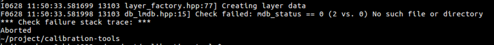
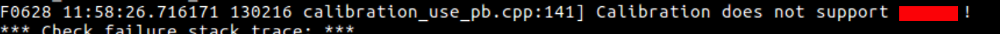
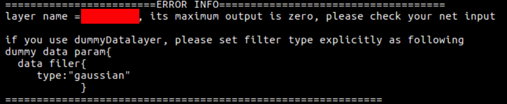

常见异常
========

没有正确设置lmdb数据集的路径
----------------------------

出现以上信息，说明没有正确设置lmdb数据集的路径，请按照章节 :ref:`prepare-lmdb` 的方法设置lmdb数据集的路径。

在 :ref:`view-demo` 中所示可视化工具运行网络时发现数据集不可用的提示，可能是因为jupyter-notebook运行的起始路径不同
或者lmdb在启动Docker时映射的路径不同等原因造成，可以使用绝对路径指定lmdb位置。

有不支持的层
------------

出现以上信息，说明当前正在转换的网络中有Quantization-tools不支持的层，请联系bitmain技术人员，予以解决。

当前Quantization-tools支持的layer见本章附录 :ref:`supported-layer` 。

整个网络输入为0
---------------

出现以上信息，说明某个层的输出最大值为0，有可能是整个网络输入的问题，请检查是否正确配置了网络的输入。也有可能是有些层的计算
比较特殊，比如并没有数据计算或者本来就是零值的常量输出等，可以分情况对待。
