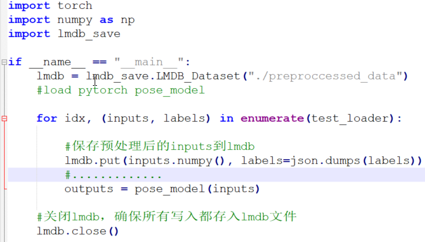
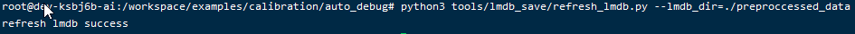

auto_calib一键式自动量化工具(beta版)
====================================

简介
----

基本原理
~~~~~~~~

使用量化校准图片集，对模型进行量化，量化为int8模型后，再使用量化模型测试图片集对int8模型的精度进行测试，若精度不满足用户预定标准，会自动进行优化策略搜索，比如：启动per-channel、启动fp32/int8混合精度计算、改变量化门限算法等，然后量化后再测试int8模型精度，如此循环直到达到满足用户预定精度前提下的最优（执行速度、模型压缩率），最终输出可在芯片上运行的int8
bmodel。

优势
~~~~

一键式完成从原始框架模型到bm1684芯片 bmodel的转换；

方便用户对int8模型的精度进行大批量的验证，形成质量优化提升闭环流程

可自动进行量化策略搜索，找到满足精度要求的最佳量化策略；

方便用户将bm1684的量化流程整合到自有训练流程中；

软件架构流程图
~~~~~~~~~~~~~~

如下图，整个量化流程包括：量化校准图片集和量化模型精度测试图片集的准备（下面蓝色框）、原始框架模型转换、自动量化策略搜索、量化执行、int8模型推理执行、后处理及精度计算、报告当前int8精度到自动量化策略搜索模型，重复上面流程，直到得到兼顾精度和执行效率的最佳策略，输出可在1684上运行的bmodel。

其中量化执行时，量化校准数据有2种方式；int8模型推理执行时，输入测试数据有3种方式；它们都各自读取于蓝色框流程生成的数据文件（见图中绿色虚线），特别的是测试数据可直接在原始框架训练环境中获取后，发送到docker中用于int8模型测试，结果再返回原始框架环境中进行处理和精度计算。

.. image:: ../_static/image1.jpg
   :width: 5.45278in
   :height: 9.69306in

目录结构
~~~~~~~~

.. image:: ../_static/image2.jpg
   :width: 1.72917in
   :height: 3.08333in

上面第1级除client外其他目录均是在docker中运行（可单独运行，也可作为服务端运行），core是核心实现；scripts是一些预定义的各类模型调试启动脚本，可参照其中demo扩展；user是一些预定义的后处理精度计算模块定义。

另外，上面client中脚本只会在docker的宿主机上作为客户端运行，与docker中服务器进行交互，其中core、scripts、user和docker中同名目录功能类似。

量化步骤
--------

准备量化校准数据
~~~~~~~~~~~~~~~~

由于需要对各层输出激活进行量化，故需要对激活的fp32值取值范围及分布进行统计，以便得到各激活的量化门限，而能最直接得到激活取值的方式就是用一些图片在网络上进行推理，然后就可收集各层输出并统计了，这个图片集就是量化校准图片集。

根据适用场景和数据格式的不同，目前支持以下2种校准数据格式：一种是原始图片地址列表文件ImageList.txt，另一种是从模型训练环境中导出的预处理后的量化校准图片集lmdb文件，下面是这2种方式的优缺点比较：

+---------------------+----------------------+----------------------+
| 类型                | 优点                 | 缺点                 |
+=====================+======================+======================+
| 方式1：原始图片格式 | 1、简单方            | 1、                  |
|                     | 便，易挑选清洗图片。 | 需要在命令行中配置预 |
|                     |                      | 处理方式，稍显繁琐。 |
|                     | 2、能较好的支持caf   |                      |
|                     | fe和tensorflow框架； | 2、兼                |
|                     |                      | 容性不够好，如pytorc |
|                     |                      | h和mxnet等支持不够。 |
|                     |                      |                      |
|                     |                      | 3、除常规的resize、c |
|                     |                      | rop、stand等预处理外 |
|                     |                      | ，更高阶的比如颜色增 |
|                     |                      | 强等预处理不能支持。 |
+---------------------+----------------------+----------------------+
| 方式2：Lmdb文件格式 | 1、保存到            | 1、保存预            |
|                     | lmdb文件中数据已完成 | 处理后数据到lmdb文件 |
|                     | 预处理，不需要在命令 | 的过程操作稍显繁琐； |
|                     | 行中配置预处理方式。 |                      |
|                     |                      | 2、挑选清洗图片需    |
|                     | 2、兼容性            | 要额外的步骤，没有方 |
|                     | 好，适用于所有框架。 | 式1直观，见章节3.3； |
|                     |                      |                      |
|                     | 3、因为数据          |                      |
|                     | 导出自原始训练环境， |                      |
|                     | 所有预处理都能支持。 |                      |
+---------------------+----------------------+----------------------+

7.2.1.1 原始图片数据放在目录中
``````````````````````````````

数据准备方法
''''''''''''

   步骤1:从模型的训练finetune图片集中挑选（采取类似训练中数据清洗的方法）约150~300张各种典型场景的图像，放在某个新建目录中，作为量化校准图片集。

   步骤2：生成挑选好图片的ImageList.txt文件，文件每一行为挑选图片的绝对路径。


参数配置方法
''''''''''''

通过calib_image_source参数配置前面图片目录地址或ImageList.txt文件地址，通过data_preproccess_str参数配置图片的预处理步骤，比如：

  .. code-block:: shell
      python3 scripts/calib_detect_model.py 

      --weights='models/MobileNetSSD_deploy.caffemodel' --model='models/MobileNetSSD_deploy.prototxt' 

      --data_preproccess_str='resize_h=512,resize_w=512;mean_value=103.94:116.78:123.68,scale=1.0' 

      --calib_image_source='models/calib_pic/ImageList.txt' --input_data_shape='(1,3,512,512)' 

      --calib_iterations=150 --test_iterations=100

上面通过data_preproccess_str字符串配置图片的resize/crop尺寸、减均值、归一化等预处理参数，比如：有2个op，通过分号’;’分隔，第1个op为resize为512x512的图片，带有2个参数：resize_h、resize_w，通过逗号’,’分隔，每个参数的值按‘参数名=值’方式赋值，若值有多个，按分号‘:’分隔，比如mean_value;第2个op为stand标准化减去3个通道的mean_value并乘上系数1.0。

另外，也可通过配置image_data_preproccess参数来选择预定义的预处理模板，当前支持的模板如下：

+--------------------------+------------------------------------------+
| 预处理模板名             | 预处理字符串                             |
+==========================+==========================================+
| vgg_tensorflow           | resize_side=256                          |
|                          | ;crop_h=224, crop_w=224;mean_value=103.9 |
|                          | 4:116.78:123.68, scale=1.0, bgr2rgb=True |
+--------------------------+------------------------------------------+
| ssd_vgg_tensorflow       | resize_h=256,resize_w=256                |
|                          | ;mean_value=103.94:116.78:123.68, scale= |
|                          | 1.0, bgr2rgb=True;crop_h=224, crop_w=224 |
+--------------------------+------------------------------------------+
| ssd_inception_tensorflow | resize_h=256, resize_w=256;s             |
|                          | cale=0.003921568859368563;crop_fraction= |
|                          | 0.875;resize_h=224, resize_w=224;mean_va |
|                          | lue=0.5:0.5:0.5, scale=2.0, bgr2rgb=True |
+--------------------------+------------------------------------------+
| user_defined             | 默认选择user_d                           |
|                          | efined，此时需要指定自定义的data_preproc |
|                          | cess_str字符串，当前支持的预处理op如下： |
|                          |                                          |
|                          | .. image:: ../_static/image8.png              |
|                          |    :width: 4.75in                        |
|                          |    :height: 0.64565in                    |
+--------------------------+------------------------------------------+

7.2.1.2 训练环境中预处理后数据存为lmdb文件
``````````````````````````````````````````

数据准备方法
''''''''''''

调用lmdbSave
python模块的put接口，将经过原始训练框架预处理后输入到网络中数据转为numpy后传入接口，同样不用存标签信息，步骤如下：

步骤1：将docker中/workspace/examples/calibration/auto_debug/tools/lmdb_save目录下的lmdb_save相关文件拷贝到你的训练环境目录中，在import
lmdb_save后，创建其中的LMDB_Dataset类，参数为保存lmdb数据的目录，如下：

import lmdb_save

lmdb = lmdb_save.LMDB_Dataset("./preproccessed_data")

步骤2：将从data_loader中取得的待输入网络的数据inputs通过lmdb_save模块的put接口保存下来：

#保存量化校准图片集lmdb文件

            lmdb.put(inputs.numpy()) 

步骤3：完成所有数据保存后，调用lmdb.close接口关闭lmdb文件操作即可。

另外，由于从data_loader中取的数据已正则归一化，不方便进行可视化挑选清洗，可参照下面3.3章节的方案进行挑选清洗。

完整操作如下，下例为在pytorch训练环境中保存lmdb文件：

.. image:: ../_static/image5.jpg
   :width: 4.67972in
   :height: 3.00694in


参数配置方法
''''''''''''

此种方法在命令行中只需要配置calib_lmdb_path参数为上面保存好lmdb文件的目录即可，无需配置预处理相关参数。

准备量化模型精度测试数据
~~~~~~~~~~~~~~~~~~~~~~~~

为了对量化后int8模型的精度进行快速而相对全面的评估，以指导量化策略的搜索,
需要从模型的测试集中挑选约100~500张各种典型场景的图像，作为量化模型精度测试图片集。

根据场景的不同，目前支持3种类型的测试数据：第1种是直接从训练环境调用网络接口将数据发送给docker内自动量化工具；第2种是从训练环境中将预处理后的测试集数据存为lmdb文件，标签存为label文件；第3种是用imagedata
layer读取目录中测试图片，同时准备好label文件并扩展精度测试；

上面3种方式，这里强烈建议第1种，次选第2种，第3种需要自行根据label文件格式，扩展相应的精度测试代码，相对比较繁琐，下面是3种方式的比较，如下表：

+----------------------+----------------------+----------------------+
| 类型                 | 优点                 | 缺点                 |
+======================+======================+======================+
| 方式1：发送预处理    | 1、可以方便的利用原  | 1                    |
| 后测试数据到docker中 | 始训练环境中已有的前 | 、需要在原始训练环境 |
|                      | 处理和后处理及精度计 | 中启动比特大陆的doc  |
|                      | 算的代码，工作量小。 | ker环境，通过RPC方式 |
|                      |                      | 访问其中的自动量化工 |
|                      |                      | 具，若跨主机交互，可 |
|                      |                      | 能存在执行效率问题。 |
+----------------------+----------------------+----------------------+
| 方式2：保存预        | 1、命令行中          | 1、若docker中预      |
| 处理后数据为lmdb文件 | 不需配置预处理参数； | 先配置好的典型模型的 |
|                      |                      | 后处理及精度计算代码 |
|                      |                      | 不能完全满足需求，需 |
|                      |                      | 要用户自己修改或扩展 |
|                      |                      | ，有一定开发工作量； |
|                      |                      |                      |
|                      |                      | 2、数                |
|                      |                      | 据保存相对稍显繁琐。 |
+----------------------+----------------------+----------------------+
| 方式3：              | 1、可比较            | 1、类似方式2，若     |
| 测试图片数据放目录中 | 方便的增删测试图片； | 既有后处理精度计算代 |
|                      |                      | 码不能满足需求，需要 |
|                      |                      | 用户自行修改或扩展。 |
|                      |                      |                      |
|                      |                      | 2、命令行中          |
|                      |                      | 需要配置预处理参数； |
+----------------------+----------------------+----------------------+

7.2.2.1 在训练环境中调用接口发送预处理后测试数据到docker中自动量化工具
``````````````````````````````````````````````````````````````````````

数据准备方法
''''''''''''

为了直接将训练环境中预处理后数据发送到bitmain发布docker中自动量化工具的网络运行时对象进行推理，步骤如下：

首先创建auto_calib_debug对象，设置docker ip地址，如下：

    #生成自动量化调试对象, ip_port为docker的ip，请求超时时间为10秒

    calib = auto_calib_debug(ip_port="172.17.0.1", timeout=10)

用for循环不断触发calib对象进行量化策略搜索，并判断是否结束、是否临时失败等，如下：

    #for循环触发calib对象尝试一种策略并进行量化

    for stat in calib:

        #若statu为None，则已找到最优策略

        if stat == 'finished':

            break

        #若calib对象返回temporary_fail，表示临时失败，直接开始下一次调试

        if stat == 'temporary_fail':

            continue

从data_loader中不断获取预处理后数据，调用run_and_get_outputs接口发送到服务端，服务端推理后返回网络输出outputs，然后，就可用这个outputs和data_loader中获取的label计算精度，如下例在pose_post_process中完成后处理并累积计算精度：

#将预处理后数据发送到docker中运行网络的输入blob中,执行网络并获取结果

           outputs = calib.run_and_get_outputs(input_blob_data)

#batch中label信息，加上推理结果outputs，结合val_metric对象就可进行精度计算

          pose_post_process(batch, outputs, val_metric)

完成预定的test_iterations次测试后，调用report_accuracy接口将score值发送到服务端，以便服务端进行量化策略选择：

# 调用report_score将精度报告到auto_calib_debug对象，

         # 以便其根据其判断进行后续调试

         calib.report_accuracy(metric_score)


参数配置方法
''''''''''''

在启动自动量化工具服务端时，scripts/auto_calib_server_start.py脚本的参数无需设置test_lmdb_path、test_image_source等参数，配置好test_iterations即可。

7.2.2.2 训练环境中预处理后测试数据存为lmdb文件
``````````````````````````````````````````````


数据准备方法
''''''''''''

此种方式默认不需要准备测试样例的label文件，auto_calib会自动保存fp32模型的结果作为label信息，然后比较int8模型的结果与这些fp32模型结果的匹配程度，范围：[0,1]。

若客户需要真实的精度值，比如检测模型的mAP指标，需要用户提供真实的测试图片的标签文件data.label，放在lmdb目录中。

当前的data.label格式支持2类模型：
    分类模型：每个图片占1行，按格式：“图片1标签、图片2标签、……、图片n标签”排列，图片标签间以逗号分割，比如，batch-size为4，某图片的label为：3,13,4,6
    检测模型：每个图片输出框占1行，按格式：“框1信息;框2信息;……;框n信息”，框信息间以分号分割，该图片所有的框信息放在一行；框信息按格式“类型、x1、y1、x2、y2”，以逗号分隔，比如：某图片有3个框：4,258,98,505,234;17,1,137,97,502;18,225,117,309,240；

Lmdb文件保存方式和7.2.1.2章节一样，若需要同时保存label，可以在调用lmdb_save时传入labels参数，如下：lmdb.put(inputs.numpy(), labels=json.dumps(labels))，上面接口会在lmdb文件目录中创建data.label文件保存各个inputs对应的labels，注意labels要按上面提到的格式。

完整实现如下：



若需要其他类型的标签信息格式，需要用户在auto_calib的user目录中自行修改或扩展新的精度计算类。


参数配置方法
''''''''''''

在docker中启动某类模型的自动量化脚本时，设置好test_lmdb_path参数即可。

7.2.2.3 测试图片文件目录
````````````````````````


数据准备方法
''''''''''''
从模型的测试集中挑选约100~500张各种典型场景的图像，放到某个目录或生成其ImageList.txt文件。标签文件的准备方法和前面7.2.2.1章节中描述完全一样。


参数配置方法
''''''''''''

类似2.1.1.2章节中方法，通过test_image_source参数配置量化模型测试图片集的文件目录或ImageList.txt文件地址，也通过data_preproccess_str参数配置图片的预处理步骤，若量化校准也是用图片目录的方式，则它们必须有相同的预处理操作，也可通过image_data_preproccess参数来选择预定义的预处理模板。

量化执行
~~~~~~~~

使用bmnnsdk2-bm1684_vX.X.X发布包启动docker环境后，在docker中执行环境初始化脚本(cd
/workspace/scripts && ./install_lib.sh nntc && source
envsetup_cmodel.sh)后，进行examples/calibration/auto_calib_debug/scripts目录下的针对各类模型的调试脚本，比如：针对分类模型的calib_classify_model.py。

7.2.3.1 命令行参数说明
``````````````````````

+---------------------------+-----------------------------------------+
| 参数名                    | 参数描述                                |
+===========================+=========================================+
| model                     | 模型文件路径，tensorfl                  |
|                           | ow的pb文件、pytorch的pt文件、mxnet的jso |
|                           | n文件、caffe和u_framework中prototxt文件 |
+---------------------------+-----------------------------------------+
| weights                   | 模型weights文                           |
|                           | 件路径，caffe中caffemodel文件、u_frame  |
|                           | work中fp32umodel文件、mxnet中params文件 |
+---------------------------+-----------------------------------------+
| test_iterations           | 测试集上                                |
|                           | 测试的迭代数，默认为0表示从lmdb或image  |
|                           | source文件中获取真实数量,               |
|                           | 可以设置小于实际数量的图片数；若是      |
|                           | 网络发送测试数据方式，需要设置该参数。  |
+---------------------------+-----------------------------------------+
| calib_iterations          | 量化校准图片数量，默                    |
|                           | 认值为0表示从lmdb或图片source文件中获取 |
|                           | 真实数量,可以设置小于实际数量的图片数； |
+---------------------------+-----------------------------------------+
| accept_int8_decay         | 可接                                    |
|                           | 受的int8模型精度下降的最大值，默认为0.  |
|                           | 005，即int8模型只容许下降最多0.5%的精度 |
+---------------------------+-----------------------------------------+
| fp32_score                | fp32模型精度，默认为                    |
|                           | 0，此时可由软件内部自动计算fp32模型精度 |
+---------------------------+-----------------------------------------+
| calib_lmdb_path           | 量化校准图片集lmdb文件路                |
|                           | 径，默认为空串，若不设置，则要求设置cal |
|                           | ib_image_source从文件目录中读取校准图片 |
+---------------------------+-----------------------------------------+
| test_lmdb_path            | 量化                                    |
|                           | 模型测试图片集lmdb文件路径，默认为空串  |
+---------------------------+-----------------------------------------+
| calib_image_source        | 量化校准图片集目录或source文件ImageLis  |
|                           | t.txt的地址，默认为空串，若不设置，则要 |
|                           | 求设置calib_lmdb_path从文件目录中读取校 |
|                           | 准图片                                  |
+---------------------------+-----------------------------------------+
| test_image_source         | 量化模型测试图                          |
|                           | 片集目录或source文件ImageList.txt的地址 |
|                           | 默认为空串                              |
+---------------------------+-----------------------------------------+
| image_data_preproccess    | 预定义的图片预处理模板，                |
|                           | 当前支持：user_defined,vgg_tensorflow,  |
|                           |                                         |
|                           | ssd_                                    |
|                           | vgg_tensorflow,ssd_inception_tensorflow |
|                           |                                         |
|                           | 默认为:                                 |
|                           | user_defined,此时需要通过data_prepro    |
|                           | ccess_str参数配置自定义的预处理字符串。 |
+---------------------------+-----------------------------------------+
| print_all_image\_         | 打印预定义的图片预处理模板详细内容      |
|                           |                                         |
| data_preproccess_detail   |                                         |
+---------------------------+-----------------------------------------+
| data_preproccess_str      | 自定义的原始图片预处理字                |
|                           | 符串，类似：'resize_h=512,resize_w=512; |
|                           |                                         |
|                           | mea                                     |
|                           | n_value=103.94:116.78:123.68,scale=1.0' |
|                           |                                         |
|                           | ，op间以分号分割，op内参数              |
|                           | 间以逗号分割，每个参数取值以‘参数名=值  |
|                           | ’的方式赋值，若值有多个值，以冒号分割。 |
+---------------------------+-----------------------------------------+
|                           |                                         |
+---------------------------+-----------------------------------------+
| input_data_name           | 网络输入t                               |
|                           | ensor名，格式如：’(input_tensor1_name); |
|                           | (input_tensor2_name)',中间以分号分割    |
+---------------------------+-----------------------------------------+
| input_data_shape          | 网络输入t                               |
|                           | ensor的shape，格式如：’(tensor1_shape); |
|                           | (tensor2_shape)',中间以分               |
|                           | 号分割,例如：’(4, 3, 224, 224);(4, 1)'  |
+---------------------------+-----------------------------------------+
| output_data_name          | 网络输出                                |
|                           | tensor名，格式如：’output_tensor1_name; |
|                           | output_tensor2_name ',中间以分号分割    |
+---------------------------+-----------------------------------------+
| auto_calib                | 使能自动量化调                          |
|                           | 试，默认为False，不使能自动量化策略搜索 |
|                           | ，能快速得到bmodel，若发现int8精度不满  |
|                           | 足要求，再使能这个选项，会进行自动量化  |
|                           | 搜索调试保证满足预期精度，但耗时比较久  |
+---------------------------+-----------------------------------------+
| use_fp32umodel_only_calib | 直接输入fp32umod                        |
|                           | el，只进行量化调试，不做将pytorch等原始 |
|                           | 框架转为fp32umodel，不将最后得到的int8  |
|                           | fp32umodel转为int8 bmodel，适合开发调试 |
+---------------------------+-----------------------------------------+
| calib_debug               | 调试命令，默认为                        |
|                           | 0，bit0置位表示打开二分分段详细搜索日志 |
+---------------------------+-----------------------------------------+

7.2.3.2 训练环境中通过网络发送测试数据到docker中自动量化工具
````````````````````````````````````````````````````````````

步骤1：在docker的examples/calibration/auto_calib_debug目录中执行scripts/auto_calib_server_start.py启动自动量化工具服务端程序，量化校准图片集相关参数配置参考2.1章节相关内容，比如如下：
  .. code-block:: shell

      python3 scripts/auto_calib_server_start.py
      --model='./backbone_resnet.pt' --input_data_shape='(1, 3, 224, 224)'
      --input_data_name='input' --output_data_name='495'

步骤2：将auto_calib_debug目录中client目录拷贝到你原始训练环境中，按前面2.2.1章节中方法在你训练环境脚本中，import并创建auto_calib_debug类，调用run_and_get_outputs接口发送网络输入数据并接收服务端返回的推理结果outputs，利用你训练环境已有的后处理及精度计算代码，在本地计算好score后调用report_score报告给服务端即可，可参照client/scripts目录中demo脚本。

7.2.3.3 使用lmdb数据来测试
``````````````````````````

步骤1：使用2.2.2章节中方法保存好数据后，在执行某模型的量化脚本时，设置test_lmdb_path参数来指定量化模型测试图片集的lmdb文件路径；
  .. code-block:: shell

      python3 calib_pose_model.py --model='./backbone_resnet_pose.pt' 

      --input_data_name='input'  --input_data_shape='(1, 3, 256, 129)'  --output_data_name='495'

      --test_lmdb_path='/path/to/test_lmdb' 

步骤2：由于各个模型的label数据格式都可能存在差异，故在通过调用

run_and_get_outputs接口得到返回的标签信息outputs[1]后，若工具还没有预定义好的、能满足你需求的后处理及精度计算模块，需要由你自行修改或扩展定义这个模块，扩展方法可参考scripts/
calib_detect_model.py中detect_accuracy类、或者类似scripts/calib_pose_mxnet_model.py中直接利用原始训练框架的COCOKeyPointsMetric等相关类。

7.2.3.4 使用原始图片数据来测试
``````````````````````````````

步骤1：参照2.2.3.2章节中方法配置test_image_source和data_preproccess_str或image_data_preproccess；

步骤2：类似使用lmdb数据来测试的方式，若工具还没有预定义好的、能满足你需求的后处理及精度计算模块，需要由你自行修改或扩展。

7.2.3.5 各种类型的量化命令
``````````````````````````

下面命令均以分类模型脚本为例：

pytorch模型量化
'''''''''''''''
  .. code-block:: shell

      python3 calib_classify_model.py --model='./test_models/pytorch/backbone_resnet.pt'

      --input_data_shape='(1, 3, 224, 224)' 

      --input_data_name='input'  --output_data_name='495'

Mxnet模型量化
'''''''''''''
  .. code-block:: shell

      python3 calib_classify_model.py --model='./test_models/mxnet/resnet18_v1b-symbol.json' 

      --weights='./test_models/mxnet/resnet18_v1b-0000.params'

       --input_data_shape='(1, 3, 224, 224)'

不需要设置input_data_name和output_data_name。

Tensorflow模型量化
''''''''''''''''''
  .. code-block:: shell

      python3 calib_classify_model.py --model='./test_models/tensorflow/frozen_resnet_v2_50.pb'

      --input_data_shape='(1, 299, 299, 3)'

      --input_data_name='input'
      --output_data_name='resnet_v2_50/predictions/Softmax'

注意原始tensorflow模型的输入shape的NHWC格式。

Caffe模型量化
'''''''''''''
  .. code-block:: shell

      python3 calib_classify_model.py --model='./test_models/caffe/ResNet-18.prototxt' 

      --weights='./test_models/caffe/ResNet-18-model.caffemodel'

      --input_data_shape='(1, 3, 224, 224)'

darknet模型量化
'''''''''''''''
  .. code-block:: shell

      python3 calib_classify_model.py --model='./test_models/darknet/yolov3-tiny/yolov3-tiny.cfg' 

      --weights='./test_models/darknet/yolov3-tiny.weights' 

      --input_data_shape='[[1, 3, 416, 416]]'

注意上面命令input_data_shape参数的格式为'[[1, 3, 416,
416]]'，不是前面的'(1, 299, 299, 3)'，后续版本修正。

配置迭代数
''''''''''

对于calib_iterations参数，默认不用设置，直接从ImageList.txt或data.mdb中统计数量，若需要尝试其他数量，可配置该参数；

对于test_iterations参数，若配置有test_lmdb_path或test_image_source参数，也可直接从相应文件进行统计；对于通过网络发送数据的情形，需要明确设置该参数，如下具体命令：

  .. code-block:: shell

      python3 calib_classify_model.py --model='./caffe_model/ResNet-18.prototxt' --weights='caffe_model/ResNet-18-model.caffemodel'

      --calib_iterations=100 --test_iterations=100

启动自动量化功能
''''''''''''''''

上面命令默认采用快速模式进行量化，若量化后精度不满足要求，可使能auto_calib选项启动自动调试功能，在更大的优化策略空间进行搜索，如下：

  .. code-block:: shell

      python3 calib_classify_model.py --model='./caffe_model/ResNet-18.prototxt' --weights='caffe_model/ResNet-18-model.caffemodel'

      --auto_calib = true

常见问题
--------

为何开启auto_calib使能后耗时大大增加？
~~~~~~~~~~~~~~~~~~~~~~~~~~~~~~~~~~~~~

答：本软件默认采取快速模式，只对per-channel、不同的th_method门限算法、针对深度卷积的accuracy_opt、第1个卷积层用fp32计算等基本策略进行判断是否可提升量化精度，故只需要约6次量化并测试int8模型，所以相对较快；若启用auto_calib功能，除了上面基本策略外，还会对整个网络进行二分搜索判断fp32和int8混合计算的分配情况，这需要重复约7~12次的量化和int8模型精度测试，尤其是在每次int8模型精度需要进行推理数test_iterations较大时，这就需要耗费更多的时间。

为何量化校准的图片建议量为150~300张？
~~~~~~~~~~~~~~~~~~~~~~~~~~~~~~~~~~~~

答：网络每层的输出tensor已有大量数值，这个数值再乘上图片数从而再增加了2个数量级，这个量是基本足够用来刻画tensor
fp32取值的大致分布的；另外根据目前主流采用的计算fp32值量化门限的KL散度算法的特点，若图片数过多、数据量过大，反而可能因为近0值量过大而导致量化门限过度下移，从而影响该门限的准确性，因此，参考一些业界的实践和实测数据，建议的量化校准图片数量一般在200~300张，对于目标检测等有检测细节准确度要求的应用，在量化精度不理想时，可能还需要适当降低图片数，故这里建议150~300张。

准备量化校准数据时，若从训练环境中保存预处理后数据为lmdb文件，这些预处理后图片数据是不可见，此时如何能够挑选清洗哪些图片比较适合用来做校准？
~~~~~~~~~~~~~~~~~~~~~~~~~~~~~~~~~~~~~~~~~~~~~~~~~~~~~~~~~~~~~~~~~~~~~~~~~~~~~~~~~~~~~~~~~~~~~~~~~~~~~~~~~~~~~~~~~~~~~~~~~~~~~~~~~~~~~~~~~~~

答：lmdb_save对此可提供支持，

步骤1：在训练环境中创建1个不带类似pytorch中ToTensor和Normalize功能的dataset，如下transforms只带resize或crop操作，不带归一化的ToTensor、正则化的Normalize：

non_normalize_dataset=torchvision.Datasets.ImageFolder('./coco/val',
transforms.Compose([

transforms.Resize(int(input_size / 0.875)),

transforms.CenterCrop(input_size)]))

同时利用该non_normalize_dataset，创建1个non_normalize_data_loader，和带归一正则化的data_loader相比，有相同的batch_size，两者的shuffle参数都为false，保证2者每次取的图片是相同的。

步骤2：调用LMDB_Dataset的put接口时，不只传入带正则归一化的images，也带上同时从non_normalize_data_loader中获取的不带正则归一化的non_transformed_images图片数据，put接口会在保存数据到lmdb中的时候也将用户可分辨挑选的jpg图片存入与data.mdb同目录的original_images目录中；

步骤3：用户可在original_images目录中浏览初步挑选的图片，然后简单删除一些不满需求的图片后，调用lmdb_save目录下的refresh_lmdb.py脚本指定lmdb_dir参数为lmdb文件目录即可，如下：


