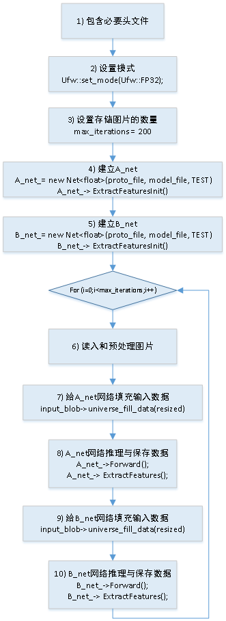

附录 1
=======

.. _supported-layer:

支持的layer
-----------

-  **A**

  ::

     active
     arg
     AnnotatedData
     Accuracy


-  **B**

  ::

     Bias
     Batchnorm
     BatchToSpace
     BroadcastBinary
     BN

-  **C**

  ::

     Compare
     Concat
     ConstBinary
     Convolution
     Crop
     CPU

-  **D**

  ::

     Data
     Deconvolution
     DetectionOutput
     Dropout
     DummyData

-  **E**

  ::

     ELU
     Eltwise
     EltwiseBinary
     ExpandDims

-  **F**

  ::

     Flatten

-  **I**

  ::

     InnerProduct
     Interp
     ImageData

-  **L**

  ::

     LRN

-  **N**

  ::

     Normalize

-  **O**

  ::

     Output

-  **P**

  ::

     Prelu
     PSROIPooling
     Pad
     Permute
     Pooling
     PoolingTF
     PriorBox

-  **R**

  ::

     ROIPooling
     RPN
     Relu
     Reciprocal
     Reduce
     ReduceFull
     Reorg
     Reshape

-  **S**

  ::

     Scale
     Select
     ShapAssign
     ShapeConst
     ShapeOp
     ShapePack
     ShapeRef
     ShapeSlice
     ShuffelChannel
     Sigmoid
     Slice
     Softmax
     SoftmaxWithLoss
     SpaceToBatch
     Split
     SplitTF
     squeeze
     StrideSlice

-  **T**

  ::

     Tile
     TopK
     Transpose

-  **U**

  ::

     Upsample
     upsampleCopy


-  **Y**

  ::

     Yolov3DetectionOutputupsampleCopy


.. _c-api:

c接口API函数
------------

- Ufw::set_mode(Ufw::mode)

  - 功能：Framework
  - 输入参数：

.. table::
   :widths: 30 20 50

   +--------------+---------------+--------------------------------------------------+
   |Parameter     |Type           |Description                                       |
   +--------------+---------------+--------------------------------------------------+
   |mode          |Input          |设置 Uframwork的运行模式，其取值见下文            |
   |              |               |                                                  |
   |              |               |CPU: 输入时float32的Umodel，并且在CPU下运行       |
   |              |               |                                                  |
   |              |               |INT8_NEURON: 输入时int8的Umodel，并且在CPU下运行其|
   |              |               |余可取值暂时未用                                  |
   +--------------+---------------+--------------------------------------------------+

- Net(const string& param_file, const string& trained_filename, Phase phase)

  - 功能：通过输入的protxt文件，建立net
  - 输入参数：

.. table::
   :widths: 30 20 50

   +----------------+----------+--------------------------------------------------+
   |Parameter       |Type      |Description                                       |
   +----------------+----------+--------------------------------------------------+
   |param_file      |Input     |prototxt的文件名                                  |
   +----------------+----------+--------------------------------------------------+
   |trained_filename|Input     |umodel的文件名 \*.fp32umodel或者\*.int8umodel     |
   +----------------+----------+--------------------------------------------------+
   |phase           |Input     |::                                                |
   |                |          |                                                  |
   |                |          |  enum Phase {                                    |
   |                |          |     TRAIN = 0,                                   |
   |                |          |     TEST = 1 };                                  |
   |                |          |                                                  |
   |                |          |推理时采用TEST                                    |
   +----------------+----------+--------------------------------------------------+

- const vector<Blob<Dtype>*>& Forward（）

  - 功能：做一次网络的前向运算
  - 输入参数：


.. table::
   :widths: 30 20 50

   =========  =====  =============
   Parameter  Type   Description
   ---------  -----  -------------
   无          无      无
   =========  =====  =============

- const shared_ptr<Blob<Dtype> >  blob_by_name(const string& blob_name)

  - 功能：根据输入的blob的名字，返回指向该blob的指针
  - 输入参数：

.. table::
   :widths: 30 20 50

   ========== ======= ==============
   Parameter  Type    Description
   ---------- ------- --------------
   blob_name  input   blob的名字
   ========== ======= ==============

- void Blob<Dtype>::Reshape(const int num, const int channels, const int height, const int width)

  - 功能：根据输入参数，重新计算blob的维度
  - 输入参数：

.. table::
   :widths: 30 20 50

   ==========  ====== =================
   Parameter   Type   Description
   ----------  ------ -----------------
   num         input  输入图片的batch_size
   channels    input  输入图片的channel数
   height      input  输入图片的高度
   width       input  输入图片的宽度
   ==========  ====== =================

- void Blob<Dtype>:: Reshape(const vector<int>& shape)

  - 功能：根据输入参数，重新计算blob的维度
  - 输入参数：

.. table::
   :widths: 30 20 50

   +--------------------+----------+--------------------------------------------------+
   |Parameter           |Type      |Description                                       |
   +--------------------+----------+--------------------------------------------------+
   |shape               |input     |shape[0] 中存放num                                |
   |                    |          |shape[1] 中存放channels                           |
   |                    |          |shape[2] 中存放height                             |
   |                    |          |shape[3] 中存放 width                             |
   +--------------------+----------+--------------------------------------------------+

- int Blob<Dtype>:: count()

  - 功能：返回blob中存的数据个数
  - 输入参数：

.. table::
   :widths: 30 20 50

   =========  =====   =============
   Parameter  Type    Description
   无
   =========  =====   =============

- int Blob<Dtype>:: num()

  - 功能：返回blob的0维度信息
  - 输入参数：

.. table::
   :widths: 30 20 50

   =========  =====   =============
   Parameter  Type    Description
   无
   =========  =====   =============

- int Blob<Dtype>:: channels()

  - 功能：返回blob的1维度信息
  - 输入参数：

.. table::
   :widths: 30 20 50

   =========  =====   =============
   Parameter  Type    Description
   无
   =========  =====   =============


- int Blob<Dtype>:: height()

  - 功能：返回blob的2维度信息
  - 输入参数：

.. table::
   :widths: 30 20 50

   =========  ====  =============
   Parameter  Type  Description
   无
   =========  ====  =============


- int Blob<Dtype>:: width()

  - 功能：返回blob的3维度信息
  - 输入参数：

.. table::
   :widths: 30 20 50

   =========  ====  =============
   Parameter  Type  Description
   无
   =========  ====  =============


- void Blob<Dtype>::universe_fill_data(const float* p_mat)

  - 功能：用指针p_mat指向的数据填充blob
  - 输入参数：

.. table::
   :widths: 30 20 50

   =========  ============    =============
   Parameter  Type            Description
   p_mat      const float*    用该指针指向的数据填充blob
   =========  ============    =============

- void Blob<Dtype>::universe_fill_data(const cv::Mat& mat)

  - 功能：用cv::Mat mat中的数据填充blob
  - 输入参数：

.. table::
   :widths: 30 20 50

   =========  ==========    =============
   Parameter  Type          Description
   mat        cv::Mat       用cv::Mat mat中的数据填充blob
   =========  ==========    =============

- Dtype*  Blob<Dtype>::universe_get_data()

  - 功能：返回blob中数据的指针，该指针是float*类型的
  - 输入参数：

.. table::
   :widths: 30 20 50

   =========  ==========    =============
   Parameter  Type          Description
   无
   =========  ==========    =============

- void ExtractFeaturesInit(std::string extract_feature_blob_names,
  std::string save_feature_dataset_names,
  int max_iteration)

  - 功能：ExtractFeatures模块的功能是读取某blob的数据，存储成lmdb。
    该函数完成该模块的初始化工作
  - 输入参数：

.. table::
   :widths: 30 20 50

   +--------------------------+----------+------------------------------------------------------------+
   |Parameter                 |Type      |Description                                                 |
   +--------------------------+----------+------------------------------------------------------------+
   |extract_feature_blob_names|string    |要存储的blob的名字。                                        |
   |                          |          |例：string extract_feature_blob_names =                     |
   |                          |          |“data” 可以一次存储多个blob，存储多个时，用逗号隔开例：     |
   |                          |          |string extract_feature_blob_names = “data，conv1_out”       |
   +--------------------------+----------+------------------------------------------------------------+
   |save_feature_dataset_names|string    |要存储的lmdb数据集的名字。例： string                       |
   |                          |          |save_feature_dataset_names = “data_save.lmdb” 可以一次存储多|
   |                          |          |个，用逗号隔开例：string save_feature_dataset_names =       |
   |                          |          |“data_save.lmdb，conv1_out_save.lmdb”                       |
   +--------------------------+----------+------------------------------------------------------------+
   |max_iteration             |int       |存储的图片个数                                              |
   +--------------------------+----------+------------------------------------------------------------+

- bool ExtractFeatures ( )

  - 功能：读取blob内的数据，存成lmdb的格式。
    每存一次内部计数加1，当达到初始化参数配置的max_iteration时，停止更新新的数据
  - 输入参数：

.. table::
   :widths: 30 20 50

   =========  ======  =============
   Parameter  Type    Description
   无          无
   =========  ======  =============

.. _python-api:

python接口
----------

- ufw.set_mode_cpu()

  - 功能：设置网络工作在fp32 cpu模式下
  - 输入参数：

.. table::
   :widths: 30 20 50

   =========  ====== =============
   Parameter  Type   Description
   无
   =========  ====== =============

- ufw.set_mode_cpu_int8()

  - 功能：设置网络工作在int8 cpu模式下
  - 输入参数：

.. table::
   :widths: 30 20 50

   =========  ====== =============
   Parameter  Type   Description
   无
   =========  ====== =============

- ufw.Net(model, weight, ufw.TEST)

  - 功能：采用model，weight建立网络
  - 输入参数：

.. table::
   :widths: 30 20 50

   =========  ====== =============
   Parameter  Type   Description
   model             表示网络结构的prototxt文件名
   weight            表示网络系数的文件名
   ufw.TEST          表示建立推理网络
   =========  ====== =============

- net.fill_blob_data({blob_name: input_data})

  - 功能：
  - 输入参数：

.. table::
   :widths: 30 20 50

   =========  ====== =============
   Parameter  Type   Description
   无
   =========  ====== =============


- net. get_blob_data (blob_name)

  - 功能：
  - 输入参数：

.. table::
   :widths: 30 20 50

   =========  ====== =============
   Parameter  Type   Description
   无
   =========  ====== =============


.. _u_framework:

程序方式生成LMDB
---------------------

运用u_framework c++接口
```````````````````````````

当网络是级联网络，或者网络有特殊的数据预处理而u_framework不支持的，可以考虑使用u_framework提供的接口存储lmdb数据集。

章节 :ref:`mtcnn-demo` 描述了级联网络如何通过该接口来存储lmdb。

此时需要基于u_framework搭建一个网络推理的框架，如图 :ref:`ch4-002` 所示

.. _ch4-002:



   通过u_framework接口存储lmdb数据集框架

1) 包含必要头文件

  .. code-block:: c++

     #include <ufw/ufw.hpp>
     using namespace ufw;

2) 设置模式

  .. code-block:: c++

     Ufw::set_mode(Ufw::FP32);                  // 设置为Ufw::FP32

3) 设置存储的图片数量

  .. code-block:: c++

     max_iterations = 200

4) 建立A_net

  .. code-block:: c++

     A_net_= new Net<float>(proto_file, model_file, TEST);   // proto_file描述网络结构的文件
                                                             // model_file描述网络系数的文件
     A_net_-> ExtractFeaturesInit();                         // 完成存储lmdb功能模块的初始化

各函数的详细定义见章节“7.2c接口API函数”。

5) 建立B_net

同4)

6) 读入图片，预处理

该步骤与待测的检测网络本身特性有关。可以使用opencv的函数。

7) 给网络填充数据

将经过预处理的图片数据填充给网络。

  .. code-block:: c++

     //根据输入blob的名字（这里是“data”），得到该blob的指针
     Blob<float> *input_blob = (net_-> blob_by_name("data")).get();

     //根据输入图片的信息，对输入blob进行reshape
     input_blob->Reshape(net_b, net_c, net_h, net_w);

     //resized的类型为cv::Mat；其中存储了经过了预处理的数据信息
     // universe_fill_data()函数会将resized中的数据填充给网络的输入blob（这里是input_blob）
     input_blob->universe_fill_data(resized);

8) A_net推理

  .. code-block:: c++

     A_net_->Forward();
     A_net_-> ExtractFeatures();

9) 给B网络填充数据

10) B_net推理


运用u_framework Python接口
``````````````````````````

a) LMDB API组成

   - lmdb = ufw.io.LMDBDataset(path, queuesize=100, mapsize=20e6) # 建立一个LMDBDataset对象

     ::

        path: 建立LMDB的路径(会自建文件夹，并将数据内容存储在文件夹下的data.mdb)
        queue_size:  缓存队列，指缓存图片数据的个数。默认为100，增加该数值会提高读写性能，但是对内存消耗较大
        mapsize:  LMDB建立时开辟的内存空间，LMDBDataset会在内存映射不够的时候自动翻倍


   - put(images, labels=None, keys=None)  # 存储图片和标签信息

     ::

        images: 图片数据，接受numpay.array格式。需要使用CHW格式，如果不符合需要提前transpose一下。数据类型可以是float或是uint8。如果数据维度为3维，则认为是单张图片(batch=1)；如果是4维，认为是多组图片，会按照batch分别存储。
        lables: 图片的lable，需要是int类型，如果没有label不填该值即可。如果设定该值，需要其长度与images的batch一致。
        keys:   LMDB的键值，可以使用原始图片的文件名，但是需要注意LMDB数据会对存储的数据按键值进行排序，推荐使用唯一且递增的键值。如果不填该值，LMDB_Dataset会自动维护一个递增的键值。

   - close()

     ::

        将缓存取内容存储，并关闭数据集。如果不使用该方法，程序会在结束的时候自动执行该方法。
        但是如果python解释器崩溃，则会导致缓存区数据丢失。

b) LMDB API使用方式

   - import ufw
   - txn = ufw.io.LMDB_Dataset('to/your/path')
   - txn.put(images)  # 放置在循环中
   - 在pytorch和tensorflow中，images通常是xxx.Tensor，可以使用images.numpy()，将其转化为numpy.array格式
   - tensorflow的tensor通常是NHWC模式，可以使用transpose([2, 0, 1])[三维数据]，或transpose([0, 3, 1, 2])[四维数据]
   - txn.close()

示例代码

  .. code-block:: python

     import ufw
     import lmdb
     import torch

     images = torch.randn([3, 3,100,100])

     path = 'test__'
     txn = ufw.io.LMDB_Dataset(path)

     for i in range(1020):
         txn.put(images.numpy())
     txn.close()

     ## test LMDB key information
     def lmdbextractinfo(path):
         with lmdb.open(path, readonly=True) as txn:
             cursor = txn.begin().cursor()
             for key, value in cursor:
                 print(key)

d) 注意事项

   - 此功能不会检查给定路径下是否已有文件，如果之前存在LMDB文件，该文件会被覆盖。
   - python解释器崩溃会导致数据丢失。
   - 如果程序正常结束，LDMB_Dataset会自动将缓存区数据写盘。也可以使用close()安全关闭写盘。
   - 使用重复的key会导致数据覆盖或污染，使用非递增的key会导致写入性能下降。
   - 解析该LMDB的时候需要使用Data layer。
   - 输入数据类型支持float、uint8。


