.. _demos_list:

附录 2
========

release包中的examples下有calibraton相关的demo程序，目录如下：

  ::

     examples
     |--- calibration
     |    `-- examples
     |       |--- classify_demo
     |       |--- create_lmdb_demo
     |       |--- face_demo
     |       |--- object_detection_python_demo
     |       |--- caffemodel_to_fp32umodel_demo
     |       |--- tf_to_fp32umodel_demo
     |       |--- pt_to_fp32umodel_demo
     |       |--- mx_to_fp32umodel_demo
     |       |--- dn_to_fp32umodel_demo
     |       |--- mtcnn_demo
     |       |--- auto_calib
     |        `-- view_demo
     |

.. _classify-demo:

示例1：classify\_demo
~~~~~~~~~~~~~~~~~~~~~

该用例将caffe框架下的resnet18网络转换成int8umodel，并测试float32原始网络的精度、测试转换后的int8网络的精度。

a) 转换成int8umodel

  .. code-block:: shell

     $ cd <release dir>/examples/calibration/classify_demo
     $ source classify_demo.sh
     $ convert_to_int8_demo

运行完毕，结果如 :ref:`fig-ch3-001` 所示。

.. _fig-ch3-001:

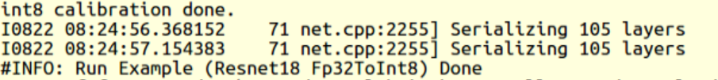

   resnet18转化int8umodel成功结果

b) 测试原始的float32网络精度

  .. code-block:: shell

     $ test_fp32_demo

运行完毕，结果如 :ref:`fig-ch3-002` 所示。

.. _fig-ch3-002:

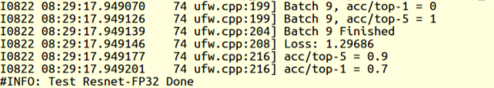

   resnet18 fp32umodel精度结果

c) 测试转换生成的int8网络的精度

  .. code-block:: shell

     $ test_int8_demo

运行完毕，结果如 :ref:`fig-ch3-003` 所示。

.. _fig-ch3-003:

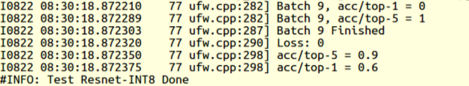

   resnet18 int8umodel精度结果

.. _create-lmdb-demo:

示例2：create\_lmdb\_demo
~~~~~~~~~~~~~~~~~~~~~~~~~

该用例将jpg图片转换成lmdb数据集。

a) 建立环境

  .. code-block:: shell

     $ cd <release dir>/examples/calibration/create_lmdb_demo
     $ source create_lmdb_demo.sh

b) 将jpg转换成lmdb

  .. code-block:: shell

     $ convert_imageset_to_lmdb_demo

运行完毕，结果如 :ref:`fig-ch3-004` 所示。

.. _fig-ch3-004:

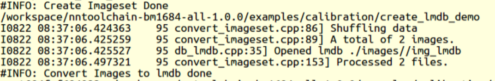

   生成LMDB数据成功

同时，在examples/calibration/create_lmdb_demo/images下会生成Imglist.txt文件、
img_lmdb文件夹。如 :ref:`fig-ch3-005` 所示。

.. _fig-ch3-005:

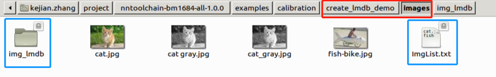

   正确生成的LMDB数据集

.. _face-demo:

示例3：face_demo
~~~~~~~~~~~~~~~~~~~~~~~~~~~~

该用例将caffe框架下的人脸检测网络squeezenet转换成int8umodel,并测试float32原始网络，
int8网络对图片的检测结果。

a) 建立环境

  .. code-block:: shell

     $ cd <release dir>/examples/calibration/face_demo
     $ source face_demo.sh

b) 用float32网络检测图片

  .. code-block:: shell

     $ detect_squeezenet_fp32

运行完毕，结果如 :ref:`fig-ch3-006` 所示。

.. _fig-ch3-006:

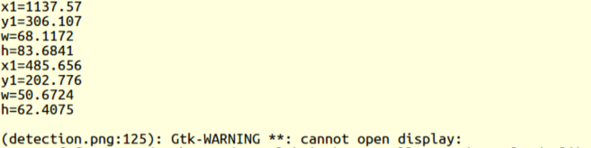

   squeezenet fp32umodel运行成功结果

同时在examples/calibration/face_demo生成检测之后的图片detection.png，如
:ref:`fig-ch3-007`: （如在docker内运行，看不到detection.png，请刷新目录）

.. _fig-ch3-007:

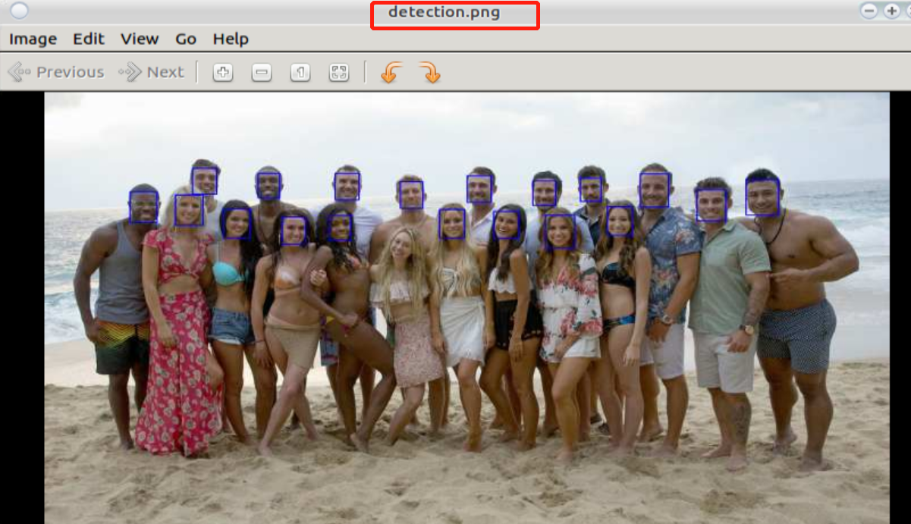

   squeezenet fp32umodel检测效果

c）转换成int8umodel

  .. code-block:: shell

     $ convert_squeezenet_to_int8

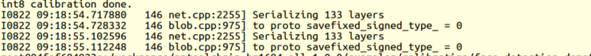

   squeezenet int8umodel转化成功输出

d）用int8网络检测图片

  .. code-block:: shell

     $ detect_squeezenet_int8

运行完毕，结果如 :ref:`fig-ch3-009`

.. _fig-ch3-009:

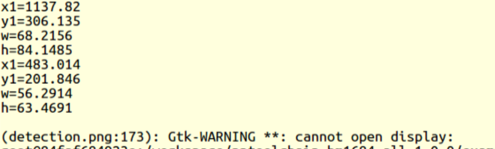

   squeezenet int8umodel检测运行成功输出

同时在examples/calibration/face_demo生成检测之后的图片detection_int8.png，如
:ref:`fig-ch3-010` 所示。

.. _fig-ch3-010:

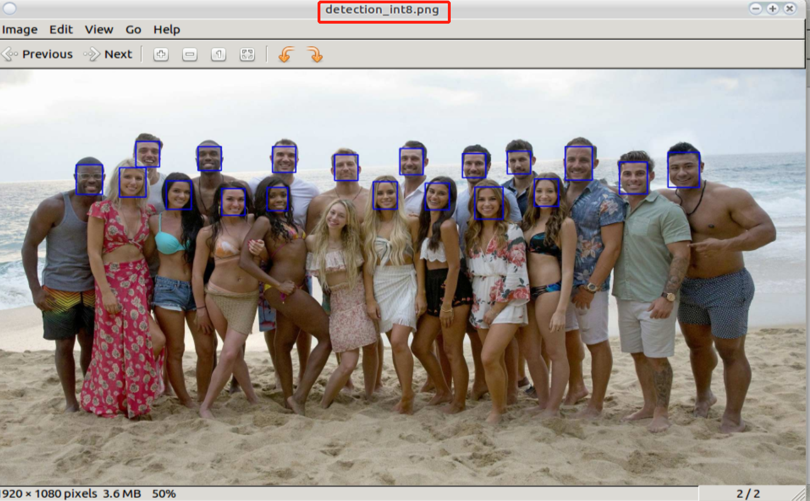

   squeezenet int8umodel检测效果

.. _object-detection-python-demo:

示例4：object_detection_python_demo
~~~~~~~~~~~~~~~~~~~~~~~~~~~~~~~~~~~
该用例以ssd_vgg300为例，描述python接口的使用方法，以方便用fp32umodel或者int8umodel建立框架程序，用于精度测试或者用于应用程序。

a) 用float32网络检测图片

  .. code-block:: shell

     $ cd <release dir>/examples/calibration/object_detection_python_demo
     $ python3 ssd_vgg300_fp32_test.py

运行完毕，结果如 :ref:`fig-ch3-011` 所示。

.. _fig-ch3-011:

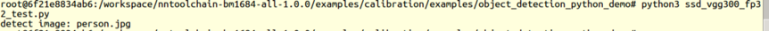

   ssd vgg300 fp32umodel运行成功输出

同时在examples/calibration/object_detection_python_demo生成检测之后的图片
person_fp32_detected.jpg，如 :ref:`fig-ch3-012` 所示。

.. _fig-ch3-012:

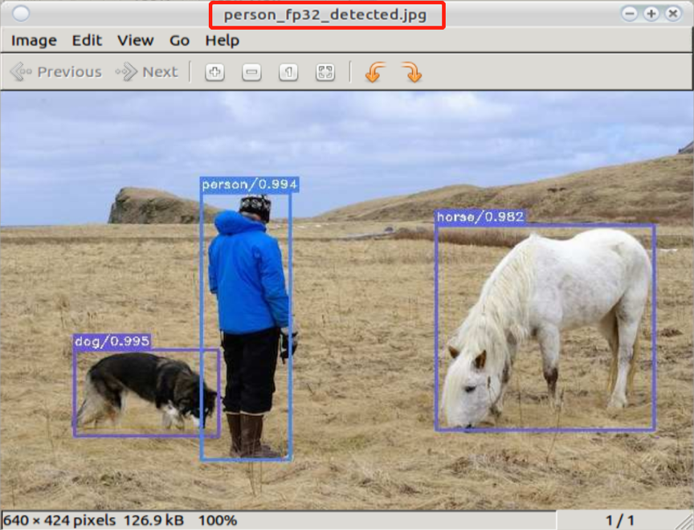

   ssd vgg300 fp32umodel检测效果

b) 用int8网络检测图片

  .. code-block:: shell

     python3 ssd_vgg300_int8_test.py

运行完毕，结果如 :ref:`fig-ch3-013` 所示。

.. _fig-ch3-013:

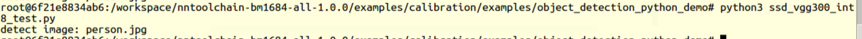

   ssd vgg300转化int8umodel成功输出

同时在examples/calibration/object_detection_python_demo生成检测之后的图片
person_int8_detected.jpg，如 :ref:`fig-ch3-014` 所示。

.. _fig-ch3-014:

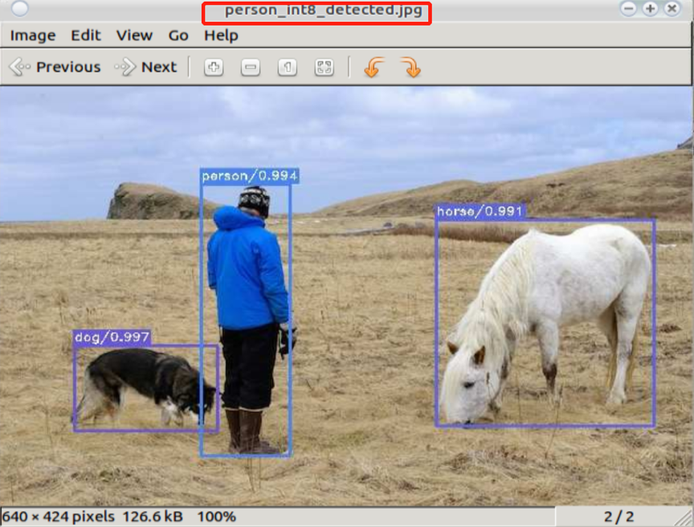

   ssd vgg300 int8umodel检测效果

.. _example_5:

示例5：caffemodel_to_fp32umodel_demo
~~~~~~~~~~~~~~~~~~~~~~~~~~~~~~~~~~~~

该用例程序以resnet50为例，描述如何将caffe框架下的模型文件（\*.caffemodel,
\*prototxt）转换成fp32umodel。

运行命令

  .. code-block:: shell

     $ cd <release dir>/examples/calibration/caffemodel_to_fp32umodel_demo
     $ python3 resnet50_to_umodel.py

运行结果如 :ref:`fig-ch3-015` 所示。

.. _fig-ch3-015:

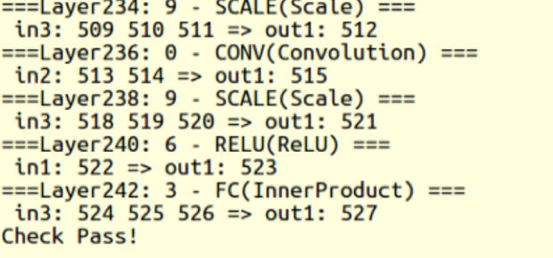

   Caffe模型转化fp32umodel成功结果

在当前文件夹下，新生成compilation文件夹，存放新生成的\*.fp32umodel 与\*.prototxt：

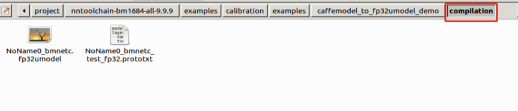

   Caffe模型转化fp32umodel成功输出

.. _example_6:

示例6：tf_to_fp32umodel_demo
~~~~~~~~~~~~~~~~~~~~~~~~~~~~

该用例程序以resnet50_v2为例，描述如何将tensorflow框架下的模型文件（\*.pb）转换成
fp32umodel。

运行命令：

  .. code-block:: shell

     $ cd <release dir>/examples/calibration/tf_to_fp32umodel_demo
     $ python3 resnet50_v2_to_umodel.py

运行结果如 :ref:`fig-ch3-017` 所示。

.. _fig-ch3-017:

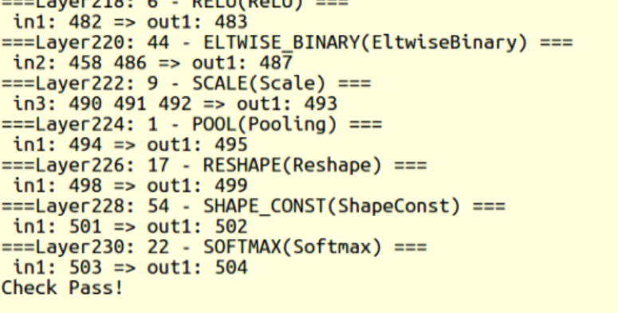

   Tensorflow模型转化fp32umodel成功结果

在当前文件夹下，新生成compilation文件夹，存放新生成的\*.fp32umodel 与\*.prototxt：

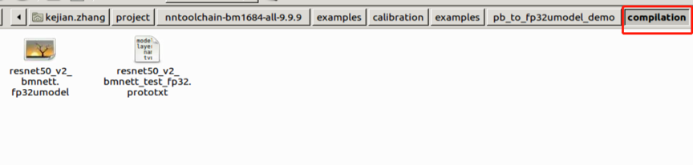

   Tensorflow模型转化fp32umodel成功输出

示例7：pt_to_fp32umodel_demo
~~~~~~~~~~~~~~~~~~~~~~~~~~~~

该用例程序以mobilenet_v2为例，描述如何将pytorch框架下的模型文件（\*.pt）转换成
fp32umodel。

运行命令：

  .. code-block:: shell

     $ cd <release dir>/examples/calibration/pt_to_fp32umodel_demo
     $ python3 mobilenet_v2_to_umodel.py

在当前文件夹下，新生成compilation文件夹，存放新生成的\*.fp32umodel 与\*.prototxt。
更详细的转化流程和细节请参考 :ref:`pytorch-to-umodel` 节内容。

示例8：mx_to_fp32umodel_demo
~~~~~~~~~~~~~~~~~~~~~~~~~~~~

该用例程序以mobilenet0.25为例，描述如何将mxnet框架下的模型文件（\*.json, \*.params）转换成
fp32umodel。

运行命令：

  .. code-block:: shell

     $ cd <release dir>/examples/calibration/mx_to_fp32umodel_demo
     $ python3 mobilenet0.25_to_umodel.py

在当前文件夹下，新生成compilation文件夹，存放新生成的*.fp32umodel 与*.prototxt。
更详细的转化流程和细节请参考 :ref:`mxnet-to-umodel` 节内容。

示例9：dn_to_fp32umodel_demo
~~~~~~~~~~~~~~~~~~~~~~~~~~~~

该用例程序以yolov3为例，描述如何将darknet框架下的模型文件（\*.cfg, \*.weights）转换成
fp32umodel。

运行命令：

  .. code-block:: shell

     $ cd <release dir>/examples/calibration/dn_to_fp32umodel_demo
     $ get_model.sh # download model
     $ python3 yolov3_to_umodel.py

在当前文件夹下，新生成compilation文件夹，存放新生成的\*.fp32umodel 与\*.prototxt。
更详细的转化流程和细节请参考 :ref:`darknet-to-umodel` 节内容。

示例10：on_to_fp32umodel_demo
~~~~~~~~~~~~~~~~~~~~~~~~~~~~~

该用例程序以postnet为例，描述如何将onnx模型文件（\*.onnx）转换成fp32umodel。

运行命令：

  .. code-block:: shell

     $ cd <release dir>/examples/calibration/on_to_fp32umodel_demo
     $ python3 postnet_to_umodel.py

在当前文件夹下，新生成compilation文件夹，存放新生成的\*.fp32umodel 与\*.prototxt。
更详细的转化流程和细节请参考 :ref:`onnx-to-umodel` 节内容。

.. _mtcnn-demo:

示例11：mtcnn_demo
~~~~~~~~~~~~~~~~~~

该用例以mtcnn为例，描述如何量化级联网络：包括为级联网络准备lmdb数据集，量化各网
络，运行demo程序。

a) 建立环境

  .. code-block:: shell

     $ cd <release dir>/examples/calibration/mtcnn_demo
     $ source mtcnn_demo.sh

b) 编译代码

  .. code-block:: shell

     $ mtcnn_build

c) 生成各网络的lmdb数据集

  .. code-block:: shell

     $ dump_fddb_lmdb

运行完毕后，会在当前目录下生成pnet，rnet，onet的lmdb数据集，如
:ref:`fig-ch3-019` 所示。

.. _fig-ch3-019:

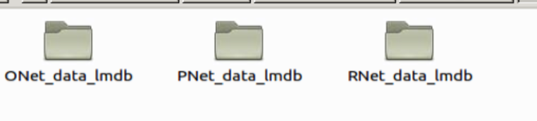

   mtcnn数据集

d) 量化各网络

量化pnet，在./model 目录下生成pnet量化后的模型：

  .. code-block:: shell

     $ convert_mtcnn_demo_pnet_to_int8_pb

量化rnet，在./model 目录下生成rnet量化后的模型：

  .. code-block:: shell

     $ convert_mtcnn_demo_rnet_to_int8_pb

量化onet，在./model 目录下生成onet量化后的模型：

  .. code-block:: shell

     $ convert_mtcnn_demo_onet_to_int8_pb

e) 运行fp32网络的demo

  .. code-block:: shell

     $ run_demo_float

f) 运行int8网络的demo

  .. code-block:: shell

     $ run_demo_int8

示例12：auto_calib
~~~~~~~~~~~~~~~~~~~~

这个目录下的自动量化工具是处于beta阶段的一键式自动量化工作，整个量化、自动调试及
精度测试流程，优先推荐客户使用，它具有如下优势：
1) 一键式完成从原始框架模型到bm1684芯片 bmodel的转换。
2) 方便用户对int8模型的精度进行大批量的验证，形成质量优化提升闭环流程。
3) 可自动进行量化策略搜索，找到满足精度要求的最佳量化策略。
4) 方便用户将bm1684的量化流程整合到自有训练流程。

详细使用方法参见“auto_calib manual.pdf”。

.. _view-demo:

示例13：view_demo
~~~~~~~~~~~~~~~~~

该用例程序以resnet18为例，描述如何分析量化后int8模型与原始float模型的精度差异。

运行命令：

  .. code-block:: shell

     $ cd <release dir>/examples/calibration/view_demo
     $ source jupyter_server.sh

运行结果如 :ref:`fig-ch3-020` 所示。

.. _fig-ch3-020:

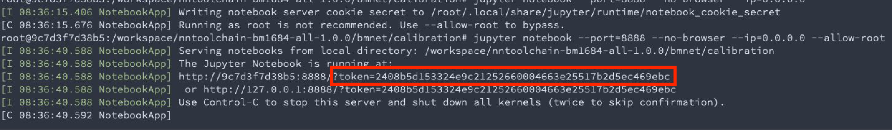

   可视化分析工具启动成功结果

根据建立docker时设置的端口号（这里以8888为例），在浏览器中输入localhost:8888，填入上述命令运行日志的token信息，进入Jupyter页面。

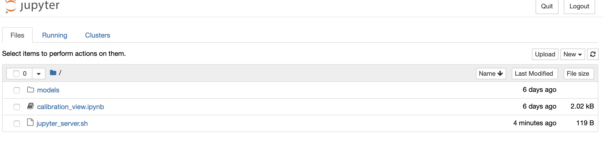

   可视化分析工具目录

选择calibration_view.ipynb，打开后在代码区执行运行。可以得到resnet18 int8模型和
float模型前向运算每层的比对结果。图 :ref:`fig-ch3-022` 为其中一个层的比对结果，
点击layer可以查看不同层的比对。

.. _fig-ch3-022:

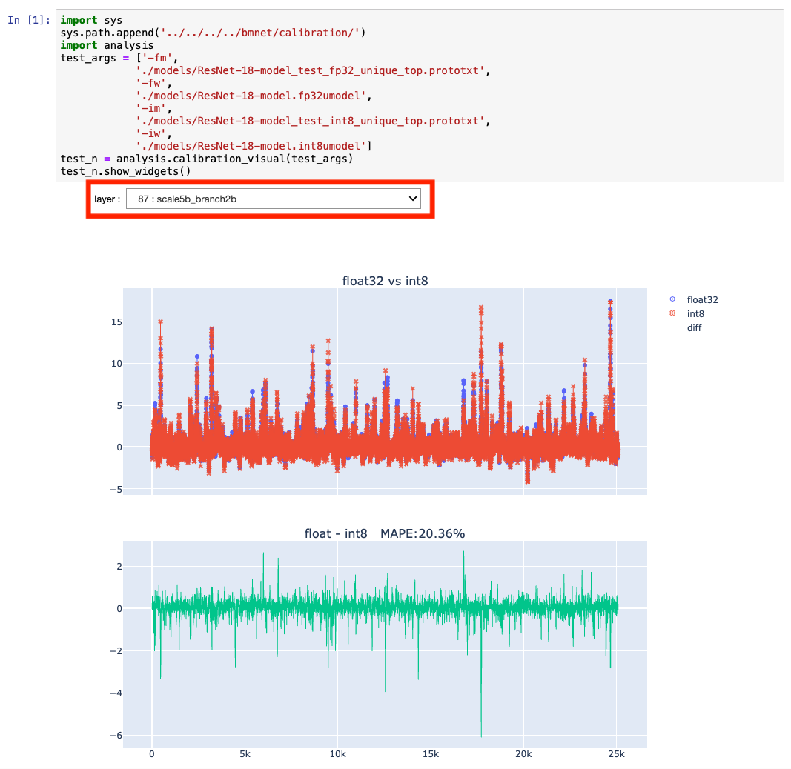

   可视化分析工具运行效果
