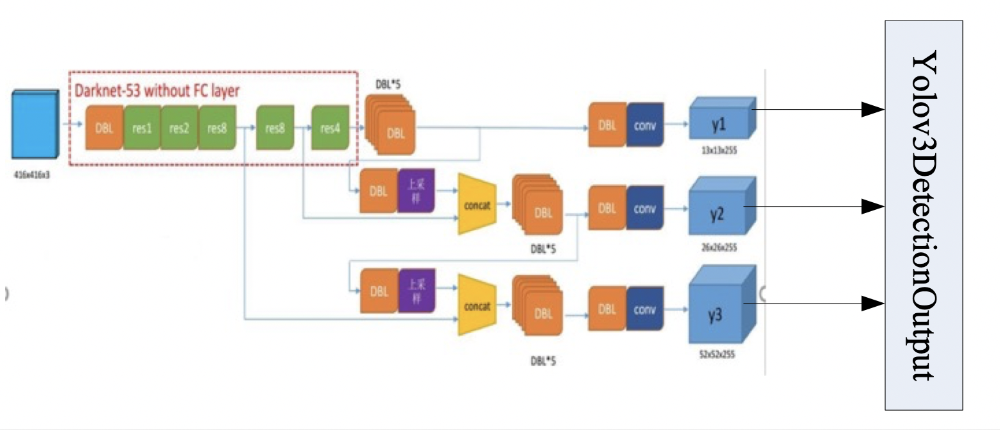
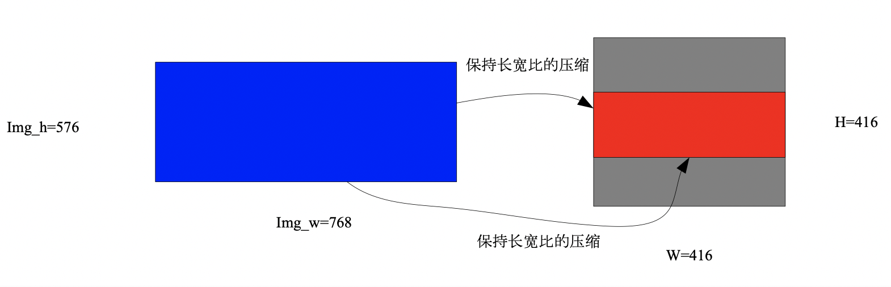

附录
====

.. _supported-layer:

支持的layer
-----------

-  **A**

  ::

     active
     arg
     AnnotatedData
     Accuracy

-  **B**

  ::

     Bias
     Batchnorm
     BatchToSpace
     BroadcastBinary
     BN

-  **C**

  ::

     Compare
     Concat
     ConstBinary
     Convolution
     Crop
     CPU

-  **D**

  ::

     Data
     Deconvolution
     DetectionOutput
     Dropout
     DummyData

-  **E**

  ::

     ELU
     Eltwise
     EltwiseBinary
     ExpandDims

-  **F**

  ::

     Flatten

-  **I**

  ::

     InnerProduct
     Interp
     ImageData

-  **L**

  ::

     LRN

-  **N**

  ::

     Normalize

-  **O**

  ::

     Output

-  **P**

  ::

     Prelu
     PSROIPooling
     Pad
     Permute
     Pooling
     PoolingTF
     PriorBox

-  **R**

  ::

     ROIPooling
     RPN
     Relu
     Reciprocal
     Reduce
     ReduceFull
     Reorg
     Reshape

-  **S**

  ::

     Scale
     Select
     ShapAssign
     ShapeConst
     ShapeOp
     ShapePack
     ShapeRef
     ShapeSlice
     ShuffelChannel
     Sigmoid
     Slice
     Softmax
     SoftmaxWithLoss
     SpaceToBatch
     Split
     SplitTF
     squeeze
     StrideSlice

-  **T**

  ::

     Tile
     TopK
     Transpose

-  **U**

  ::

     Upsample
     upsampleCopy

-  **Y**

  ::

     Yolov3DetectionOutputupsampleCopy

.. _c-api:

c接口API函数
------------

- Ufw::set_mode(Ufw::mode)

  - 功能：Framework
  - 输入参数：

.. table::
   :widths: 30 20 50

   +--------------+---------------+--------------------------------------------------+
   |Parameter     |Type           |Description                                       |
   +--------------+---------------+--------------------------------------------------+
   |mode          |Input          |设置 Uframwork的运行模式，其取值见下文            |
   |              |               |                                                  |
   |              |               |CPU: 输入时float32的Umodel，并且在CPU下运行       |
   |              |               |                                                  |
   |              |               |INT8_NEURON: 输入时int8的Umodel，并且在CPU下运行其|
   |              |               |余可取值暂时未用                                  |
   +--------------+---------------+--------------------------------------------------+

- Net(const string& param_file, Phase phase)

  - 功能：通过输入的protxt文件，建立net
  - 输入参数：

.. table::
   :widths: 30 20 50

   +------------+----------+--------------------------------------------------+
   |Parameter   |Type      |Description                                       |
   +------------+----------+--------------------------------------------------+
   |param_file  |Input     |prototxt的文件名                                  |
   +------------+----------+--------------------------------------------------+
   |phase       |Input     |::                                                |
   |            |          |                                                  |
   |            |          |  enum Phase {                                    |
   |            |          |     TRAIN = 0,                                   |
   |            |          |     TEST = 1 };                                  |
   |            |          |                                                  |
   |            |          |推理时采用TEST                                    |
   +------------+----------+--------------------------------------------------+

- void Net<Dtype>::CopyTrainedLayersFrom(const string& trained_filename)

  - 功能：给已经建立好的网络的各层系数幅值
  - 输入参数：

.. table::
   :widths: 30 20  50

   =================  =======  ================================
   Parameter          Type     Description
   -----------------  -------  --------------------------------
   trained_filename   Input    umodel的文件名 \*.fp32umodel或者\*.int8umodel
   =================  =======  ================================

- const vector<Blob<Dtype>*>& Forward（）

  - 功能：做一次网络的前向运算
  - 输入参数：

.. table::
   :widths: 30 20 50

   =========  =====  =============
   Parameter  Type   Description
   ---------  -----  -------------
   无          无      无
   =========  =====  =============

- const shared_ptr<Blob<Dtype> >  blob_by_name(const string& blob_name)

  - 功能：根据输入的blob的名字，返回指向该blob的指针
  - 输入参数：

.. table::
   :widths: 30 20 50

   ========== ======= ==============
   Parameter  Type    Description
   ---------- ------- --------------
   blob_name  input   blob的名字
   ========== ======= ==============

- void Blob<Dtype>::Reshape(const int num, const int channels, const int height, const int width)

  - 功能：根据输入参数，重新计算blob的维度
  - 输入参数：

.. table::
   :widths: 30 20 50

   ==========  ====== =================
   Parameter   Type   Description
   ----------  ------ -----------------
   num         input  输入图片的batch_size
   channels    input  输入图片的channel数
   height      input  输入图片的高度
   width       input  输入图片的宽度
   ==========  ====== =================

- void Blob<Dtype>:: Reshape(const vector<int>& shape)

  - 功能：根据输入参数，重新计算blob的维度
  - 输入参数：

.. table::
   :widths: 30 20 50

   +--------------------+----------+--------------------------------------------------+
   |Parameter           |Type      |Description                                       |
   +--------------------+----------+--------------------------------------------------+
   |shape               |input     |shape[0] 中存放num                                |
   |                    |          |shape[1] 中存放channels                           |
   |                    |          |shape[2] 中存放height                             |
   |                    |          |shape[3] 中存放 width                             |
   +--------------------+----------+--------------------------------------------------+

- int Blob<Dtype>:: count()

  - 功能：返回blob中存的数据个数
  - 输入参数：

.. table::
   :widths: 30 20 50

   =========  =====   =============
   Parameter  Type    Description
   无
   =========  =====   =============

- int Blob<Dtype>:: num()

  - 功能：返回blob的0维度信息
  - 输入参数：

.. table::
   :widths: 30 20 50

   =========  =====   =============
   Parameter  Type    Description
   无
   =========  =====   =============

- int Blob<Dtype>:: channels()

  - 功能：返回blob的1维度信息
  - 输入参数：

.. table::
   :widths: 30 20 50

   =========  =====   =============
   Parameter  Type    Description
   无
   =========  =====   =============

- int Blob<Dtype>:: height()

  - 功能：返回blob的2维度信息
  - 输入参数：

.. table::
   :widths: 30 20 50

   =========  ====  =============
   Parameter  Type  Description
   无
   =========  ====  =============

- int Blob<Dtype>:: width()

  - 功能：返回blob的3维度信息
  - 输入参数：

.. table::
   :widths: 30 20 50

   =========  ====  =============
   Parameter  Type  Description
   无
   =========  ====  =============

- void Blob<Dtype>::universe_fill_data(const float* p_mat)

  - 功能：用指针p_mat指向的数据填充blob
  - 输入参数：

.. table::
   :widths: 30 20 50

   =========  ============    =============
   Parameter  Type            Description
   p_mat      const float*    用该指针指向的数据填充blob
   =========  ============    =============

- void Blob<Dtype>::universe_fill_data(const cv::Mat& mat)

  - 功能：用cv::Mat mat中的数据填充blob
  - 输入参数：

.. table::
   :widths: 30 20 50

   =========  ==========    =============
   Parameter  Type          Description
   mat        cv::Mat       用cv::Mat mat中的数据填充blob
   =========  ==========    =============

- Dtype*  Blob<Dtype>::universe_get_data()

  - 功能：返回blob中数据的指针，该指针是float*类型的
  - 输入参数：

.. table::
   :widths: 30 20 50

   =========  ==========    =============
   Parameter  Type          Description
   无
   =========  ==========    =============

- void ExtractFeaturesInit(std::string extract_feature_blob_names,
  std::string save_feature_dataset_names,
  int max_iteration)

  - 功能：ExtractFeatures模块的功能是读取某blob的数据，存储成lmdb。
    该函数完成该模块的初始化工作
  - 输入参数：

.. table::
   :widths: 30 20 50

   +--------------------------+----------+------------------------------------------------------------+
   |Parameter                 |Type      |Description                                                 |
   +--------------------------+----------+------------------------------------------------------------+
   |extract_feature_blob_names|string    |要存储的blob的名字。                                        |
   |                          |          |例：string extract_feature_blob_names =                     |
   |                          |          |“data” 可以一次存储多个blob，存储多个时，用逗号隔开例：     |
   |                          |          |string extract_feature_blob_names = “data，conv1_out”       |
   +--------------------------+----------+------------------------------------------------------------+
   |save_feature_dataset_names|string    |要存储的lmdb数据集的名字。例： string                       |
   |                          |          |save_feature_dataset_names = “data_save.lmdb” 可以一次存储多|
   |                          |          |个，用逗号隔开例：string save_feature_dataset_names =       |
   |                          |          |“data_save.lmdb，conv1_out_save.lmdb”                       |
   +--------------------------+----------+------------------------------------------------------------+
   |max_iteration             |int       |存储的图片个数                                              |
   +--------------------------+----------+------------------------------------------------------------+

- bool ExtractFeatures ( )

  - 功能：读取blob内的数据，存成lmdb的格式。
    每存一次内部计数加1，当达到初始化参数配置的max_iteration时，停止更新新的数据
  - 输入参数：

.. table::
   :widths: 30 20 50

   =========  ======  =============
   Parameter  Type    Description
   无          无
   =========  ======  =============

.. _python-api:

python接口
----------

- ufw.set_mode_cpu()

  - 功能：设置网络工作在fp32 cpu模式下
  - 输入参数：

.. table::
   :widths: 30 20 50

   =========  ====== =============
   Parameter  Type   Description
   无
   =========  ====== =============

- ufw.set_mode_cpu_int8()

  - 功能：设置网络工作在int8 cpu模式下
  - 输入参数：

.. table::
   :widths: 30 20 50

   =========  ====== =============
   Parameter  Type   Description
   无
   =========  ====== =============

- ufw.Net(model, weight, ufw.TEST)

  - 功能：采用model，weight建立网络
  - 输入参数：

.. table::
   :widths: 30 20 50

   =========  ====== =============
   Parameter  Type   Description
   model             表示网络结构的prototxt文件名
   weight            表示网络系数的文件名
   ufw.TEST          表示建立推理网络
   =========  ====== =============

- net.fill_blob_data({blob_name: input_data})

  - 功能：
  - 输入参数：

.. table::
   :widths: 30 20 50

   =========  ====== =============
   Parameter  Type   Description
   无
   =========  ====== =============

- net. get_blob_data (blob_name)

  - 功能：
  - 输入参数：

.. table::
   :widths: 30 20 50

   =========  ====== =============
   Parameter  Type   Description
   无
   =========  ====== =============

yolov3DetectionOutputlayer说明
------------------------------

   yolov3DetectionOutputlayer 与 三个输入分支的关系

.. table:: yolo各分支特征

   =======  ======= ======== =========  ======  ======  ======= ======  ======  ========
   分支              y1分支                      y2分支                   y3分支
   -------  --------------------------  ----------------------- ------------------------
   特征图            13*13                       26*26                   52*52
   -------  --------------------------  ----------------------- ------------------------
   先验框    116*90  156*198   373*326   30*61   62*45   59*119  10*13   16*30   33*23
   =======  ======= ======== =========  ======  ======  ======= ======  ======  ========

本层的配置参数
~~~~~~~~~~~~~~

  ::

    layer {
        bottom: "y1-conv-out"                  #y1分支的输出blob名字
        bottom: " y2-conv-out "                #y2分支的输出blob名字
        bottom: " y3-conv-out "                #y3分支的输出blob名字
        type: "Yolov3DetectionOutput"
        top: "detection_out"
        name: "detection_out"
        yolov3_detection_output_param {
            nms_threshold: 0.45
            confidence_threshold: 0.5
            num_classes: 80
            biases: 10        #y3分支先验框
            biases: 13        #y3分支先验框
            biases: 16        #y3分支先验框
            biases: 30        #y3分支先验框
            biases: 33        #y3分支先验框
            biases: 23        #y3分支先验框
            biases: 30        #y2分支先验框
            biases: 61        #y2分支先验框
            biases: 62        #y2分支先验框
            biases: 45        #y2分支先验框
            biases: 59        #y2分支先验框
            biases: 119       #y2分支先验框
            biases: 116       #y1分支先验框
            biases: 90        #y1分支先验框
            biases: 156       #y1分支先验框
            biases: 198       #y1分支先验框
            biases: 373       #y1分支先验框
            biases: 326       #y1分支先验框
            mask: 6
            mask: 7
            mask: 8
            mask: 3
            mask: 4
            mask: 5
            mask: 0
            mask: 1
            mask: 2
            mask_group_num: 3
            anchors_scale: 32      #y1分支feature-map对输入图像相比的下采样
            anchors_scale: 16      #y2分支feature-map对输入图像相比的下采样
            anchors_scale: 8       #y3分支feature-map对输入图像相比的下采样
        }
    }

本层的输出
~~~~~~~~~~

a) 输出维度为

  ::

     （1,1，num_box,7）

b) num_box的解释：
   表示检测到的框的个数，
   当检测到的框的个数为0时，num_box=batch_size（输出维度不能为0，所以用batch_size来填充，用下文中的indx0来标识是否真的检测到物体）

c) “7”的解释

  - indx0：表示是否检测到物体，0：检测到物体；-1： 未检测到物体
  - indx1：检测到的物体类别
  - indx2：confidence值
  - indx3：检测框的x    ∈[0,1], 以网络输入的W做了归一化
  - indx4：检测框的y    ∈[0,1], 以网络输入的H做了归一化
  - indx5：检测框的w    ∈[0,1], 以网络输入的W做了归一化
  - indx6：检测框的h    ∈[0,1], 以网络输入的H做了归一化

应用程序对检测框的后处理
~~~~~~~~~~~~~~~~~~~~~~~~

.. _ch7-002:

   yolov3对输入数据的预处理

根据yolov3网络的描述，其对输入图片的预处理如图 :ref:`ch7-002` 所示：

a) yolov3网络要求输入是W=H=416
b) 将原始图片在保持长宽比的情况下进行压缩，保证较长的一边压缩到416
c) 较短的一边两侧进行填充，扩充到416

因为yolov3DetectionOutputlayer输出的x，y，w，h是基于W=H=416进行归一化的，需要应用程序进一步后处理，以映射到原始图片的坐标上。

  .. code-block:: shell

     W=416       #yolo网络要求的输入图片的大小
     H=416       #yolo网络要求的输入图片的大小
     scale_factor = min(W/img_w, H/img_h)     #img_w，img_h是原始图片的大小
     x_abs = (2*W*x-W+img_w*scale_factor)/(2*scale_factor)
     y_abs = (2*H*y-H+img_h*scale_factor)/(2*scale_factor)
     w_abs = w*W/scale_factor
     h_abs = h*H/scale_factor

这里x_abs，y_abs，w_abs, h_abs表示的是原始图片上的绝对坐标，可以直接用于画框
